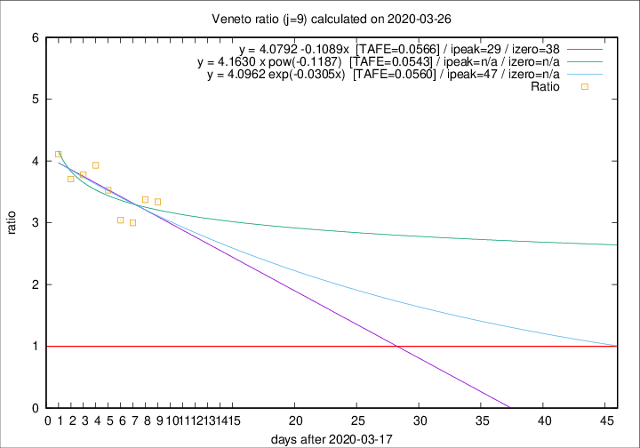

# Veneto

Data source: https://raw.githubusercontent.com/pcm-dpc/COVID-19/master/dati-json/dpc-covid19-ita-regioni.json

Estimates in this page were made on 12/4/2020 with data available until 26/03/2020.

## Summary 

### Peak estimate 
|j|linear [TAFE]|exponential [TAFE]|power law [TAFE]|details|
|---|----|-----------|---------|-------|
|7|16/4/2020 [TAFE=0.0876]|29/4/2020 [TAFE=0.0881]|-|[analysis](COVID-19_veneto_j7_2020-03-26.md)|
|8|13/4/2020 [TAFE=0.0779]|27/4/2020 [TAFE=0.0764]|-|[analysis](COVID-19_veneto_j8_2020-03-26.md)|
|9|16/4/2020 [TAFE=0.0566]|4/5/2020 [TAFE=0.0560]|-|[analysis](COVID-19_veneto_j9_2020-03-26.md)|
|10|6/4/2020 [TAFE=0.0819]|20/4/2020 [TAFE=0.0757]|-|[analysis](COVID-19_veneto_j10_2020-03-26.md)|
|11|-|-|-||
|12|-|-|-||
|13|-|-|-||
|14|-|-|-||

Best estimator is exp with j=9 (TAFE=0.0560)
Corresponding peak date estimate is 4/5/2020 (ipeak 47)

Peak date range estimate: 18/3/2020 - 4/5/2020

### End estimate 
|j|linear [TAFE/TFE]|exponential [TAFE/TFE]|power law [TAFE/TFE]|details|
|---|----|-----------|---------|-------|
|7|1/5/2020 [TAFE=0.0876]|-|-|[analysis](COVID-19_veneto_j7_2020-03-26.md)|
|8|22/4/2020 [TAFE=0.0779]|-|-|[analysis](COVID-19_veneto_j8_2020-03-26.md)|
|9|25/4/2020 [TAFE=0.0566]|-|-|[analysis](COVID-19_veneto_j9_2020-03-26.md)|
|10|-|-|-|[analysis](COVID-19_veneto_j10_2020-03-26.md)|
|11|-|-|-||
|12|-|-|-||
|13|-|-|-||
|14|-|-|-||

Best estimator is linear with j=9 (TAFE=0.0566)
Corresponding end date estimate is 25/4/2020 (izero 38)

End date range estimate: 18/3/2020 - 29/4/2020

Generated April 12th, 2020 at 17:02:01 UTC+0200 with https://github.com/robianc/COVID-19
