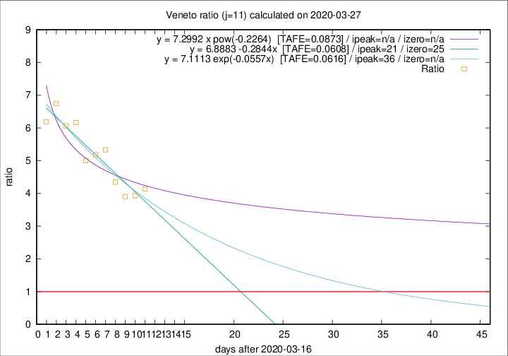

# Veneto

Data source: https://raw.githubusercontent.com/pcm-dpc/COVID-19/master/dati-json/dpc-covid19-ita-regioni.json

Delta days analysis (j): 11

Analyses for other values of j for 2020-03-27 are avalable [here](../README.md)

Analyses for Veneto for previous dates are avalable [here](../../README.md)

## Fitting 
|fit type|best fit equation|tafe|tfe|ipeak|izero|
|-------|-----|--------|------|---|---|
|linear|y = 6.8883 -0.2844x  [TAFE=0.0608]|0.0608|0.0046|21|25|
|exp|y = 7.1113 exp(-0.0557x)  [TAFE=0.0616]|0.0616|0.0024|36|n/a|
|pow|y = 7.2992 x pow(-0.2264)  [TAFE=0.0873]|0.0873|0.0050|n/a|n/a|

## Data
|Date|Daily deaths|Cumulated deaths|Deaths in the last 11 days|Deaths in the 11 days before|ratio|
|----|----------|-----------|-------|--------------------|-----|
|2020-03-27|26|313|244|59|4.1356|
|2020-03-26|29|287|224|57|3.9298|
|2020-03-25|42|258|203|52|3.9038|
|2020-03-24|24|216|174|40|4.3500|
|2020-03-23|23|192|160|30|5.3333|
|2020-03-22|23|169|140|27|5.1852|
|2020-03-21|15|146|120|24|5.0000|
|2020-03-20|16|131|111|18|6.1667|
|2020-03-19|21|115|97|16|6.0625|
|2020-03-18|14|94|81|12|6.7500|
|2020-03-17|11|80|68|11|6.1818|

[Download data as CSV](COVID-19_veneto_j11_2020-03-27.csv)

Generated April 12th, 2020 at 16:28:18 UTC+0200 with https://github.com/robianc/COVID-19
