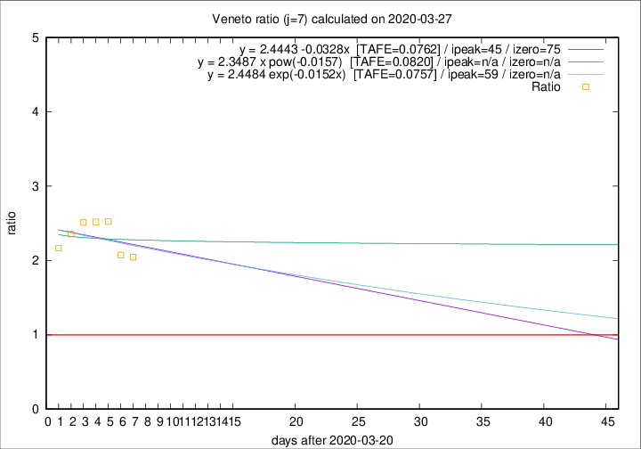

# Veneto

Data source: https://raw.githubusercontent.com/pcm-dpc/COVID-19/master/dati-json/dpc-covid19-ita-regioni.json

Delta days analysis (j): 7

Analyses for other values of j for 2020-03-27 are avalable [here](../2020-03-27/README.md)

Analyses for Veneto for previous dates are avalable [here](../README.md)

## Fitting 
|fit type|best fit equation|tafe|tfe|ipeak|izero|
|-------|-----|--------|------|---|---|
|linear|y = 2.4443 -0.0328x  [TAFE=0.0762]|0.0762|0.0067|45|75|
|exp|y = 2.4484 exp(-0.0152x)  [TAFE=0.0757]|0.0757|0.0032|59|n/a|
|pow|y = 2.3487 x pow(-0.0157)  [TAFE=0.0820]|0.0820|0.0037|n/a|n/a|

## Data
|Date|Daily deaths|Cumulated deaths|Deaths in the last 7 days|Deaths in the 7 days before|ratio|
|----|----------|-----------|-------|--------------------|-----|
|2020-03-27|26|313|182|89|2.0449|
|2020-03-26|29|287|172|83|2.0723|
|2020-03-25|42|258|164|65|2.5231|
|2020-03-24|24|216|136|54|2.5185|
|2020-03-23|23|192|123|49|2.5102|
|2020-03-22|23|169|106|45|2.3556|
|2020-03-21|15|146|91|42|2.1667|

[Download data as CSV](COVID-19_veneto_j7_2020-03-27.csv)

Generated April 19th, 2020 at 18:42:39 UTC+0200 with https://github.com/robianc/COVID-19
