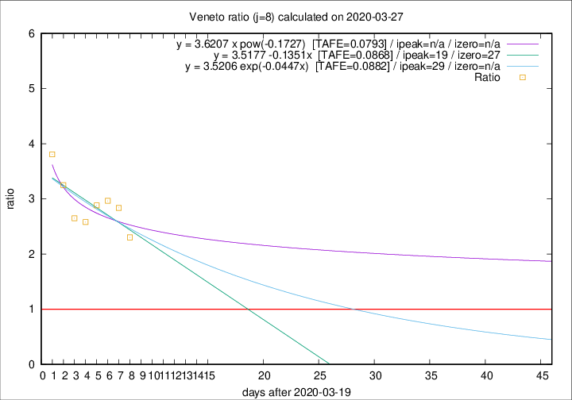

# Veneto

Data source: https://raw.githubusercontent.com/pcm-dpc/COVID-19/master/dati-json/dpc-covid19-ita-regioni.json

Delta days analysis (j): 8

Analyses for other values of j for 2020-03-27 are avalable [here](../2020-03-27/README.md)

Analyses for Veneto for previous dates are avalable [here](../README.md)

## Fitting 
|fit type|best fit equation|tafe|tfe|ipeak|izero|
|-------|-----|--------|------|---|---|
|linear|y = 3.5177 -0.1351x  [TAFE=0.0868]|0.0868|0.0098|19|27|
|exp|y = 3.5206 exp(-0.0447x)  [TAFE=0.0882]|0.0882|0.0048|29|n/a|
|pow|y = 3.6207 x pow(-0.1727)  [TAFE=0.0793]|0.0793|0.0038|n/a|n/a|

## Data
|Date|Daily deaths|Cumulated deaths|Deaths in the last 8 days|Deaths in the 8 days before|ratio|
|----|----------|-----------|-------|--------------------|-----|
|2020-03-27|26|313|198|86|2.3023|
|2020-03-26|29|287|193|68|2.8382|
|2020-03-25|42|258|178|60|2.9667|
|2020-03-24|24|216|147|51|2.8824|
|2020-03-23|23|192|129|50|2.5800|
|2020-03-22|23|169|114|43|2.6512|
|2020-03-21|15|146|104|32|3.2500|
|2020-03-20|16|131|99|26|3.8077|

[Download data as CSV](COVID-19_veneto_j8_2020-03-27.csv)

Generated April 14th, 2020 at 19:16:04 UTC+0200 with https://github.com/robianc/COVID-19
