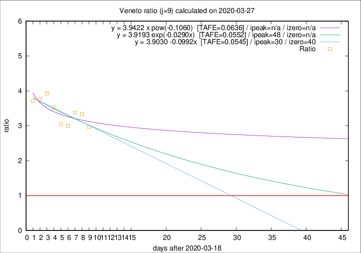

# Veneto

Data source: https://raw.githubusercontent.com/pcm-dpc/COVID-19/master/dati-json/dpc-covid19-ita-regioni.json

Delta days analysis (j): 9

## Fitting 
|fit type|best fit equation|tafe|tfe|ipeak|izero|
|-------|-----|--------|------|---|---|
|linear|y = 3.9030 -0.0992x  [TAFE=0.0545]|0.0545|0.0043|30|40|
|exp|y = 3.9193 exp(-0.0290x)  [TAFE=0.0552]|0.0552|0.0021|48|n/a|
|pow|y = 3.9422 x pow(-0.1060)  [TAFE=0.0636]|0.0636|0.0024|n/a|n/a|

## Data
|Date|Daily deaths|Cumulated deaths|Deaths in the last 9 days|Deaths in the 9 days before|ratio|
|----|----------|-----------|-------|--------------------|-----|
|2020-03-27|26|313|219|74|2.9595|
|2020-03-26|29|287|207|62|3.3387|
|2020-03-25|42|258|189|56|3.3750|
|2020-03-24|24|216|153|51|3.0000|
|2020-03-23|23|192|137|45|3.0444|
|2020-03-22|23|169|127|36|3.5278|
|2020-03-21|15|146|114|29|3.9310|
|2020-03-20|16|131|102|27|3.7778|
|2020-03-19|21|115|89|24|3.7083|

[Download data as CSV](COVID-19_veneto_j9_2020-03-27.csv)

Generated April 8th, 2020 at 23:43:36 UTC+0200 with https://github.com/robianc/COVID-19
