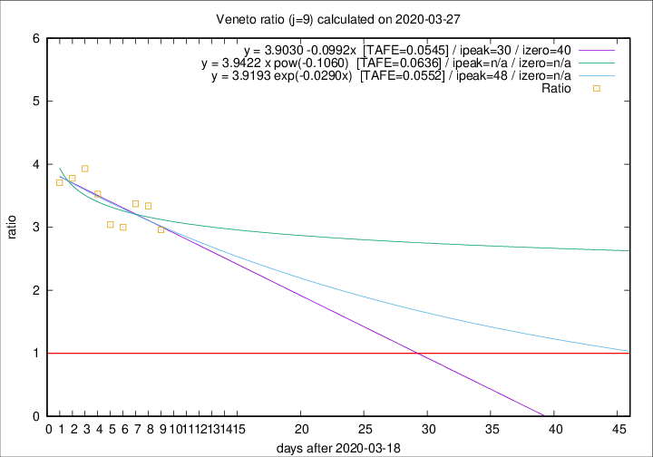

# Veneto

Data source: https://raw.githubusercontent.com/pcm-dpc/COVID-19/master/dati-json/dpc-covid19-ita-regioni.json

Estimates in this page were made on 10/4/2020 with data available until 27/03/2020.

## Summary 

### Peak estimate 
|j|linear [TAFE]|exponential [TAFE]|power law [TAFE]|details|
|---|----|-----------|---------|-------|
|7|5/5/2020 [TAFE=0.0762]|19/5/2020 [TAFE=0.0757]|-|[analysis](COVID-19_veneto_j7_2020-03-27.md)|
|8|8/4/2020 [TAFE=0.0868]|18/4/2020 [TAFE=0.0882]|-|[analysis](COVID-19_veneto_j8_2020-03-27.md)|
|9|18/4/2020 [TAFE=0.0545]|6/5/2020 [TAFE=0.0552]|-|[analysis](COVID-19_veneto_j9_2020-03-27.md)|
|10|11/4/2020 [TAFE=0.0629]|27/4/2020 [TAFE=0.0592]|-|[analysis](COVID-19_veneto_j10_2020-03-27.md)|
|11|7/4/2020 [TAFE=0.0608]|22/4/2020 [TAFE=0.0616]|-|[analysis](COVID-19_veneto_j11_2020-03-27.md)|
|12|-|-|-||
|13|-|-|-||
|14|-|-|-||

Best estimator is linear with j=9 (TAFE=0.0545)
Corresponding peak date estimate is 18/4/2020 (ipeak 30)

Peak date range estimate: 19/3/2020 - 17/5/2020

### End estimate 
|j|linear [TAFE/TFE]|exponential [TAFE/TFE]|power law [TAFE/TFE]|details|
|---|----|-----------|---------|-------|
|7|4/6/2020 [TAFE=0.0762]|-|-|[analysis](COVID-19_veneto_j7_2020-03-27.md)|
|8|-|-|-|[analysis](COVID-19_veneto_j8_2020-03-27.md)|
|9|28/4/2020 [TAFE=0.0545]|-|-|[analysis](COVID-19_veneto_j9_2020-03-27.md)|
|10|-|-|-|[analysis](COVID-19_veneto_j10_2020-03-27.md)|
|11|-|-|-|[analysis](COVID-19_veneto_j11_2020-03-27.md)|
|12|-|-|-||
|13|-|-|-||
|14|-|-|-||

Best estimator is linear with j=9 (TAFE=0.0545)
Corresponding end date estimate is 28/4/2020 (izero 40)

End date range estimate: 19/3/2020 - 2/6/2020

Generated April 10th, 2020 at 17:26:10 UTC+0200 with https://github.com/robianc/COVID-19
