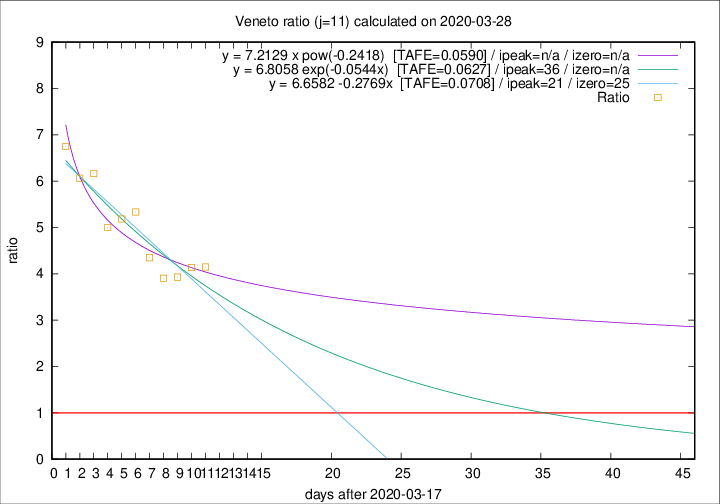

# Veneto

Data source: https://raw.githubusercontent.com/pcm-dpc/COVID-19/master/dati-json/dpc-covid19-ita-regioni.json

Delta days analysis (j): 11

## Fitting 
|fit type|best fit equation|tafe|tfe|ipeak|izero|
|-------|-----|--------|------|---|---|
|linear|y = 6.6582 -0.2769x  [TAFE=0.0708]|0.0708|0.0051|21|25|
|exp|y = 6.8058 exp(-0.0544x)  [TAFE=0.0627]|0.0627|0.0028|36|n/a|
|pow|y = 7.2129 x pow(-0.2418)  [TAFE=0.0590]|0.0590|0.0026|n/a|n/a|

## Data
|Date|Daily deaths|Cumulated deaths|Deaths in the last 11 days|Deaths in the 11 days before|ratio|
|----|----------|-----------|-------|--------------------|-----|
|2020-03-28|49|362|282|68|4.1471|
|2020-03-27|26|313|244|59|4.1356|
|2020-03-26|29|287|224|57|3.9298|
|2020-03-25|42|258|203|52|3.9038|
|2020-03-24|24|216|174|40|4.3500|
|2020-03-23|23|192|160|30|5.3333|
|2020-03-22|23|169|140|27|5.1852|
|2020-03-21|15|146|120|24|5.0000|
|2020-03-20|16|131|111|18|6.1667|
|2020-03-19|21|115|97|16|6.0625|
|2020-03-18|14|94|81|12|6.7500|

[Download data as CSV](COVID-19_veneto_j11_2020-03-28.csv)

Generated April 9th, 2020 at 16:40:48 UTC+0200 with https://github.com/robianc/COVID-19
