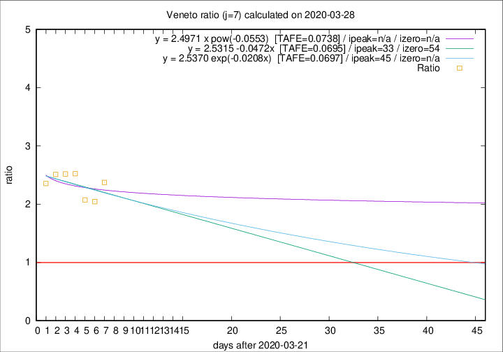

# Veneto

Data source: https://raw.githubusercontent.com/pcm-dpc/COVID-19/master/dati-json/dpc-covid19-ita-regioni.json

Delta days analysis (j): 7

Analyses for other values of j for 2020-03-28 are avalable [here](../2020-03-28/README.md)

Analyses for Veneto for previous dates are avalable [here](../README.md)

## Fitting 
|fit type|best fit equation|tafe|tfe|ipeak|izero|
|-------|-----|--------|------|---|---|
|linear|y = 2.5315 -0.0472x  [TAFE=0.0695]|0.0695|0.0053|33|54|
|exp|y = 2.5370 exp(-0.0208x)  [TAFE=0.0697]|0.0697|0.0026|45|n/a|
|pow|y = 2.4971 x pow(-0.0553)  [TAFE=0.0738]|0.0738|0.0029|n/a|n/a|

## Data
|Date|Daily deaths|Cumulated deaths|Deaths in the last 7 days|Deaths in the 7 days before|ratio|
|----|----------|-----------|-------|--------------------|-----|
|2020-03-28|49|362|216|91|2.3736|
|2020-03-27|26|313|182|89|2.0449|
|2020-03-26|29|287|172|83|2.0723|
|2020-03-25|42|258|164|65|2.5231|
|2020-03-24|24|216|136|54|2.5185|
|2020-03-23|23|192|123|49|2.5102|
|2020-03-22|23|169|106|45|2.3556|

[Download data as CSV](COVID-19_veneto_j7_2020-03-28.csv)

Generated April 16th, 2020 at 20:09:19 UTC+0200 with https://github.com/robianc/COVID-19
