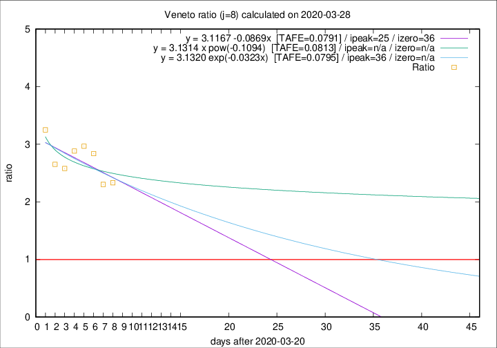

# Veneto

Data source: https://raw.githubusercontent.com/pcm-dpc/COVID-19/master/dati-json/dpc-covid19-ita-regioni.json

Delta days analysis (j): 8

## Fitting 
|fit type|best fit equation|tafe|tfe|ipeak|izero|
|-------|-----|--------|------|---|---|
|linear|y = 3.1167 -0.0869x  [TAFE=0.0791]|0.0791|0.0070|25|36|
|exp|y = 3.1320 exp(-0.0323x)  [TAFE=0.0795]|0.0795|0.0033|36|n/a|
|pow|y = 3.1314 x pow(-0.1094)  [TAFE=0.0813]|0.0813|0.0036|n/a|n/a|

## Data
|Date|Daily deaths|Cumulated deaths|Deaths in the last 8 days|Deaths in the 8 days before|ratio|
|----|----------|-----------|-------|--------------------|-----|
|2020-03-28|49|362|231|99|2.3333|
|2020-03-27|26|313|198|86|2.3023|
|2020-03-26|29|287|193|68|2.8382|
|2020-03-25|42|258|178|60|2.9667|
|2020-03-24|24|216|147|51|2.8824|
|2020-03-23|23|192|129|50|2.5800|
|2020-03-22|23|169|114|43|2.6512|
|2020-03-21|15|146|104|32|3.2500|

[Download data as CSV](COVID-19_veneto_j8_2020-03-28.csv)

Generated April 8th, 2020 at 23:43:36 UTC+0200 with https://github.com/robianc/COVID-19
