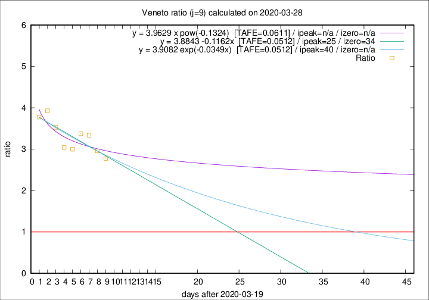

# Veneto

Data source: https://raw.githubusercontent.com/pcm-dpc/COVID-19/master/dati-json/dpc-covid19-ita-regioni.json

Estimates in this page were made on 9/4/2020 with data available until 28/03/2020.

## Summary 

### Peak estimate 
|j|linear [TAFE]|exponential [TAFE]|power law [TAFE]|details|
|---|----|-----------|---------|-------|
|7|24/4/2020 [TAFE=0.0695]|6/5/2020 [TAFE=0.0697]|-|[analysis](COVID-19_veneto_j7_2020-03-28.md)|
|8|15/4/2020 [TAFE=0.0791]|26/4/2020 [TAFE=0.0795]|-|[analysis](COVID-19_veneto_j8_2020-03-28.md)|
|9|14/4/2020 [TAFE=0.0512]|29/4/2020 [TAFE=0.0512]|-|[analysis](COVID-19_veneto_j9_2020-03-28.md)|
|10|12/4/2020 [TAFE=0.0674]|28/4/2020 [TAFE=0.0619]|-|[analysis](COVID-19_veneto_j10_2020-03-28.md)|
|11|8/4/2020 [TAFE=0.0708]|23/4/2020 [TAFE=0.0627]|-|[analysis](COVID-19_veneto_j11_2020-03-28.md)|
|12|-|-|-||
|13|-|-|-||
|14|-|-|-||

Best estimator is linear with j=9 (TAFE=0.0512)
Corresponding peak date estimate is 14/4/2020 (ipeak 25)

Peak date range estimate: 20/3/2020 - 4/5/2020

### End estimate 
|j|linear [TAFE/TFE]|exponential [TAFE/TFE]|power law [TAFE/TFE]|details|
|---|----|-----------|---------|-------|
|7|15/5/2020 [TAFE=0.0695]|-|-|[analysis](COVID-19_veneto_j7_2020-03-28.md)|
|8|-|-|-|[analysis](COVID-19_veneto_j8_2020-03-28.md)|
|9|23/4/2020 [TAFE=0.0512]|-|-|[analysis](COVID-19_veneto_j9_2020-03-28.md)|
|10|-|-|-|[analysis](COVID-19_veneto_j10_2020-03-28.md)|
|11|-|-|-|[analysis](COVID-19_veneto_j11_2020-03-28.md)|
|12|-|-|-||
|13|-|-|-||
|14|-|-|-||

Best estimator is linear with j=9 (TAFE=0.0512)
Corresponding end date estimate is 23/4/2020 (izero 34)

End date range estimate: 20/3/2020 - 13/5/2020

Generated April 9th, 2020 at 16:40:48 UTC+0200 with https://github.com/robianc/COVID-19
