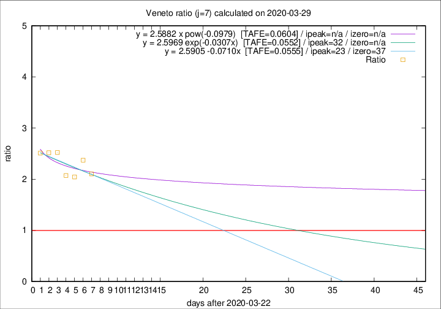

# Veneto

Data source: https://raw.githubusercontent.com/pcm-dpc/COVID-19/master/dati-json/dpc-covid19-ita-regioni.json

Delta days analysis (j): 7

Analyses for other values of j for 2020-03-29 are avalable [here](../README.md)

Analyses for Veneto for previous dates are avalable [here](../../README.md)

## Fitting 
|fit type|best fit equation|tafe|tfe|ipeak|izero|
|-------|-----|--------|------|---|---|
|linear|y = 2.5905 -0.0710x  [TAFE=0.0555]|0.0555|0.0045|23|37|
|exp|y = 2.5969 exp(-0.0307x)  [TAFE=0.0552]|0.0552|0.0021|32|n/a|
|pow|y = 2.5882 x pow(-0.0979)  [TAFE=0.0604]|0.0604|0.0023|n/a|n/a|

## Data
|Date|Daily deaths|Cumulated deaths|Deaths in the last 7 days|Deaths in the 7 days before|ratio|
|----|----------|-----------|-------|--------------------|-----|
|2020-03-29|30|392|223|106|2.1038|
|2020-03-28|49|362|216|91|2.3736|
|2020-03-27|26|313|182|89|2.0449|
|2020-03-26|29|287|172|83|2.0723|
|2020-03-25|42|258|164|65|2.5231|
|2020-03-24|24|216|136|54|2.5185|
|2020-03-23|23|192|123|49|2.5102|

[Download data as CSV](COVID-19_veneto_j7_2020-03-29.csv)

Generated April 10th, 2020 at 17:26:10 UTC+0200 with https://github.com/robianc/COVID-19
