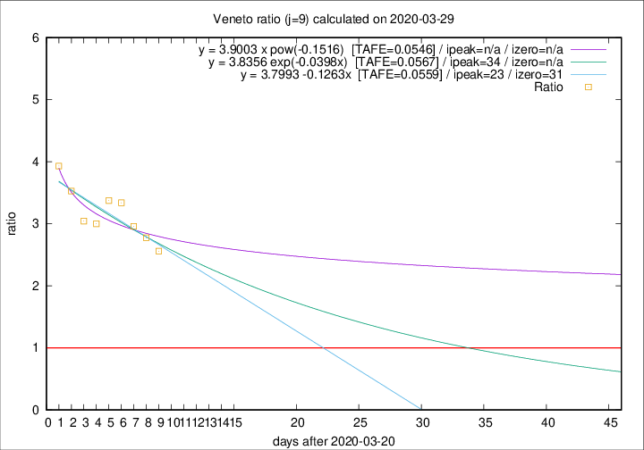

# Veneto

Data source: https://raw.githubusercontent.com/pcm-dpc/COVID-19/master/dati-json/dpc-covid19-ita-regioni.json

Delta days analysis (j): 9

Analyses for other values of j for 2020-03-29 are avalable [here](../README.md)

Analyses for Veneto for previous dates are avalable [here](../../README.md)

## Fitting 
|fit type|best fit equation|tafe|tfe|ipeak|izero|
|-------|-----|--------|------|---|---|
|linear|y = 3.7993 -0.1263x  [TAFE=0.0559]|0.0559|0.0046|23|31|
|exp|y = 3.8356 exp(-0.0398x)  [TAFE=0.0567]|0.0567|0.0022|34|n/a|
|pow|y = 3.9003 x pow(-0.1516)  [TAFE=0.0546]|0.0546|0.0023|n/a|n/a|

## Data
|Date|Daily deaths|Cumulated deaths|Deaths in the last 9 days|Deaths in the 9 days before|ratio|
|----|----------|-----------|-------|--------------------|-----|
|2020-03-29|30|392|261|102|2.5588|
|2020-03-28|49|362|247|89|2.7753|
|2020-03-27|26|313|219|74|2.9595|
|2020-03-26|29|287|207|62|3.3387|
|2020-03-25|42|258|189|56|3.3750|
|2020-03-24|24|216|153|51|3.0000|
|2020-03-23|23|192|137|45|3.0444|
|2020-03-22|23|169|127|36|3.5278|
|2020-03-21|15|146|114|29|3.9310|

[Download data as CSV](COVID-19_veneto_j9_2020-03-29.csv)

Generated April 12th, 2020 at 16:28:18 UTC+0200 with https://github.com/robianc/COVID-19
