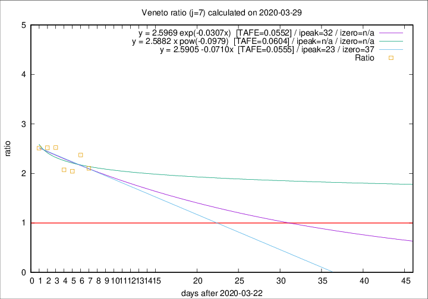

# Veneto

Data source: https://raw.githubusercontent.com/pcm-dpc/COVID-19/master/dati-json/dpc-covid19-ita-regioni.json

Estimates in this page were made on 8/4/2020 with data available until 29/03/2020.

## Summary 

### Peak estimate 
|j|linear [TAFE]|exponential [TAFE]|power law [TAFE]|details|
|---|----|-----------|---------|-------|
|7|15/4/2020 [TAFE=0.0555]|24/4/2020 [TAFE=0.0552]|-|[analysis](COVID-19_veneto_j7_2020-03-29.md)|
|8|23/4/2020 [TAFE=0.0707]|6/5/2020 [TAFE=0.0703]|-|[analysis](COVID-19_veneto_j8_2020-03-29.md)|
|9|13/4/2020 [TAFE=0.0559]|24/4/2020 [TAFE=0.0567]|-|[analysis](COVID-19_veneto_j9_2020-03-29.md)|
|10|14/4/2020 [TAFE=0.0567]|29/4/2020 [TAFE=0.0569]|-|[analysis](COVID-19_veneto_j10_2020-03-29.md)|
|11|10/4/2020 [TAFE=0.0679]|25/4/2020 [TAFE=0.0611]|-|[analysis](COVID-19_veneto_j11_2020-03-29.md)|
|12|-|-|-||
|13|-|-|-||
|14|-|-|-||

Best estimator is exp with j=7 (TAFE=0.0552)
Corresponding peak date estimate is 24/4/2020 (ipeak 32)

Peak date range estimate: 23/3/2020 - 7/5/2020

### End estimate 
|j|linear [TAFE/TFE]|exponential [TAFE/TFE]|power law [TAFE/TFE]|details|
|---|----|-----------|---------|-------|
|7|29/4/2020 [TAFE=0.0555]|-|-|[analysis](COVID-19_veneto_j7_2020-03-29.md)|
|8|-|-|-|[analysis](COVID-19_veneto_j8_2020-03-29.md)|
|9|-|-|-|[analysis](COVID-19_veneto_j9_2020-03-29.md)|
|10|-|-|-|[analysis](COVID-19_veneto_j10_2020-03-29.md)|
|11|-|-|-|[analysis](COVID-19_veneto_j11_2020-03-29.md)|
|12|-|-|-||
|13|-|-|-||
|14|-|-|-||

Best estimator is linear with j=7 (TAFE=0.0555)
Corresponding end date estimate is 29/4/2020 (izero 37)

End date range estimate: 23/3/2020 - 10/5/2020

Generated April 8th, 2020 at 23:43:36 UTC+0200 with https://github.com/robianc/COVID-19
