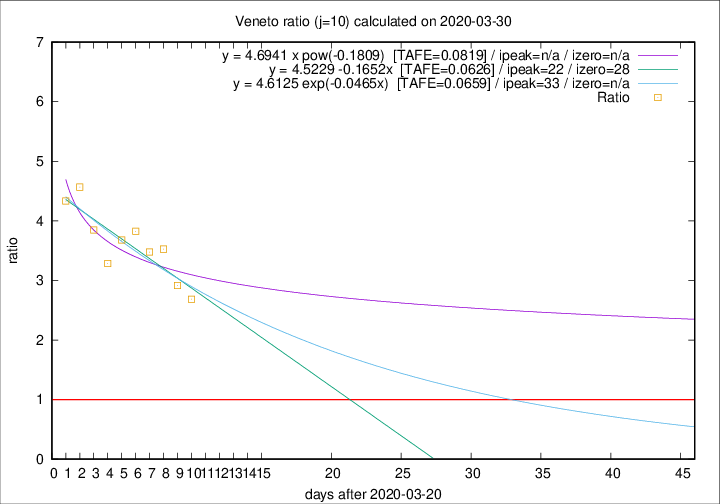

# Veneto

Data source: https://raw.githubusercontent.com/pcm-dpc/COVID-19/master/dati-json/dpc-covid19-ita-regioni.json

Delta days analysis (j): 10

Analyses for other values of j for 2020-03-30 are avalable [here](../README.md)

Analyses for Veneto for previous dates are avalable [here](../../README.md)

## Fitting 
|fit type|best fit equation|tafe|tfe|ipeak|izero|
|-------|-----|--------|------|---|---|
|linear|y = 4.5229 -0.1652x  [TAFE=0.0626]|0.0626|0.0061|22|28|
|exp|y = 4.6125 exp(-0.0465x)  [TAFE=0.0659]|0.0659|0.0030|33|n/a|
|pow|y = 4.6941 x pow(-0.1809)  [TAFE=0.0819]|0.0819|0.0041|n/a|n/a|

## Data
|Date|Daily deaths|Cumulated deaths|Deaths in the last 10 days|Deaths in the 10 days before|ratio|
|----|----------|-----------|-------|--------------------|-----|
|2020-03-30|21|413|282|105|2.6857|
|2020-03-29|30|392|277|95|2.9158|
|2020-03-28|49|362|268|76|3.5263|
|2020-03-27|26|313|233|67|3.4776|
|2020-03-26|29|287|218|57|3.8246|
|2020-03-25|42|258|195|53|3.6792|
|2020-03-24|24|216|161|49|3.2857|
|2020-03-23|23|192|150|39|3.8462|
|2020-03-22|23|169|137|30|4.5667|
|2020-03-21|15|146|117|27|4.3333|

[Download data as CSV](COVID-19_veneto_j10_2020-03-30.csv)

Generated April 10th, 2020 at 17:26:10 UTC+0200 with https://github.com/robianc/COVID-19
