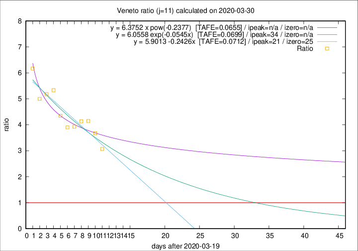

# Veneto

Data source: https://raw.githubusercontent.com/pcm-dpc/COVID-19/master/dati-json/dpc-covid19-ita-regioni.json

Delta days analysis (j): 11

Analyses for other values of j for 2020-03-30 are avalable [here](../2020-03-30/README.md)

Analyses for Veneto for previous dates are avalable [here](../README.md)

## Fitting 
|fit type|best fit equation|tafe|tfe|ipeak|izero|
|-------|-----|--------|------|---|---|
|linear|y = 5.9013 -0.2426x  [TAFE=0.0712]|0.0712|0.0055|21|25|
|exp|y = 6.0558 exp(-0.0545x)  [TAFE=0.0699]|0.0699|0.0027|34|n/a|
|pow|y = 6.3752 x pow(-0.2377)  [TAFE=0.0655]|0.0655|0.0035|n/a|n/a|

## Data
|Date|Daily deaths|Cumulated deaths|Deaths in the last 11 days|Deaths in the 11 days before|ratio|
|----|----------|-----------|-------|--------------------|-----|
|2020-03-30|21|413|298|97|3.0722|
|2020-03-29|30|392|298|81|3.6790|
|2020-03-28|49|362|282|68|4.1471|
|2020-03-27|26|313|244|59|4.1356|
|2020-03-26|29|287|224|57|3.9298|
|2020-03-25|42|258|203|52|3.9038|
|2020-03-24|24|216|174|40|4.3500|
|2020-03-23|23|192|160|30|5.3333|
|2020-03-22|23|169|140|27|5.1852|
|2020-03-21|15|146|120|24|5.0000|
|2020-03-20|16|131|111|18|6.1667|

[Download data as CSV](COVID-19_veneto_j11_2020-03-30.csv)

Generated April 14th, 2020 at 19:16:04 UTC+0200 with https://github.com/robianc/COVID-19
