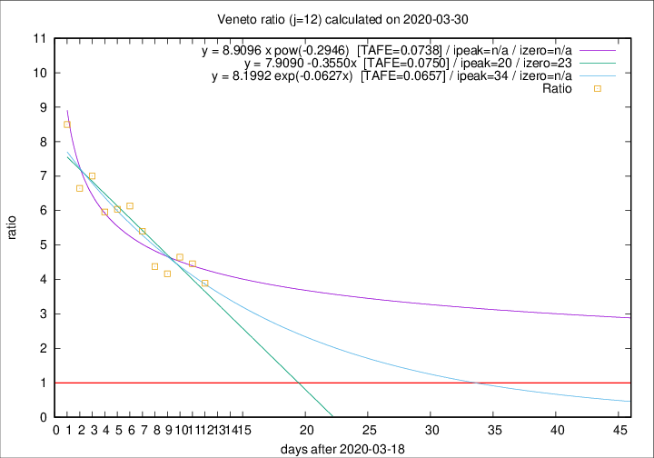

# Veneto

Data source: https://raw.githubusercontent.com/pcm-dpc/COVID-19/master/dati-json/dpc-covid19-ita-regioni.json

Delta days analysis (j): 12

Analyses for other values of j for 2020-03-30 are avalable [here](../2020-03-30/README.md)

Analyses for Veneto for previous dates are avalable [here](../README.md)

## Fitting 
|fit type|best fit equation|tafe|tfe|ipeak|izero|
|-------|-----|--------|------|---|---|
|linear|y = 7.9090 -0.3550x  [TAFE=0.0750]|0.0750|0.0053|20|23|
|exp|y = 8.1992 exp(-0.0627x)  [TAFE=0.0657]|0.0657|0.0030|34|n/a|
|pow|y = 8.9096 x pow(-0.2946)  [TAFE=0.0738]|0.0738|0.0036|n/a|n/a|

## Data
|Date|Daily deaths|Cumulated deaths|Deaths in the last 12 days|Deaths in the 12 days before|ratio|
|----|----------|-----------|-------|--------------------|-----|
|2020-03-30|21|413|319|82|3.8902|
|2020-03-29|30|392|312|70|4.4571|
|2020-03-28|49|362|293|63|4.6508|
|2020-03-27|26|313|250|60|4.1667|
|2020-03-26|29|287|232|53|4.3774|
|2020-03-25|42|258|216|40|5.4000|
|2020-03-24|24|216|184|30|6.1333|
|2020-03-23|23|192|163|27|6.0370|
|2020-03-22|23|169|143|24|5.9583|
|2020-03-21|15|146|126|18|7.0000|
|2020-03-20|16|131|113|17|6.6471|
|2020-03-19|21|115|102|12|8.5000|

[Download data as CSV](COVID-19_veneto_j12_2020-03-30.csv)

Generated April 16th, 2020 at 20:09:19 UTC+0200 with https://github.com/robianc/COVID-19
