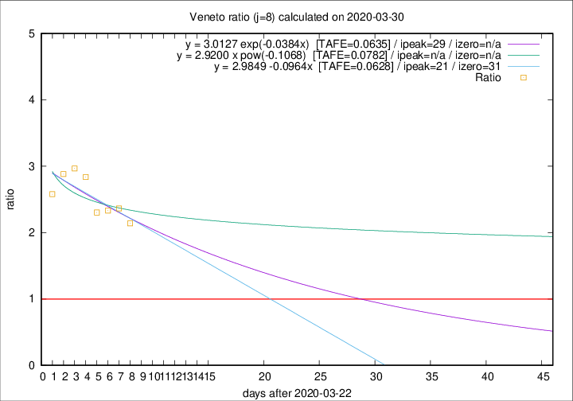

# Veneto

Data source: https://raw.githubusercontent.com/pcm-dpc/COVID-19/master/dati-json/dpc-covid19-ita-regioni.json

Delta days analysis (j): 8

## Fitting 
|fit type|best fit equation|tafe|tfe|ipeak|izero|
|-------|-----|--------|------|---|---|
|linear|y = 2.9849 -0.0964x  [TAFE=0.0628]|0.0628|0.0053|21|31|
|exp|y = 3.0127 exp(-0.0384x)  [TAFE=0.0635]|0.0635|0.0026|29|n/a|
|pow|y = 2.9200 x pow(-0.1068)  [TAFE=0.0782]|0.0782|0.0040|n/a|n/a|

## Data
|Date|Daily deaths|Cumulated deaths|Deaths in the last 8 days|Deaths in the 8 days before|ratio|
|----|----------|-----------|-------|--------------------|-----|
|2020-03-30|21|413|244|114|2.1404|
|2020-03-29|30|392|246|104|2.3654|
|2020-03-28|49|362|231|99|2.3333|
|2020-03-27|26|313|198|86|2.3023|
|2020-03-26|29|287|193|68|2.8382|
|2020-03-25|42|258|178|60|2.9667|
|2020-03-24|24|216|147|51|2.8824|
|2020-03-23|23|192|129|50|2.5800|

[Download data as CSV](COVID-19_veneto_j8_2020-03-30.csv)

Generated April 9th, 2020 at 16:40:48 UTC+0200 with https://github.com/robianc/COVID-19
