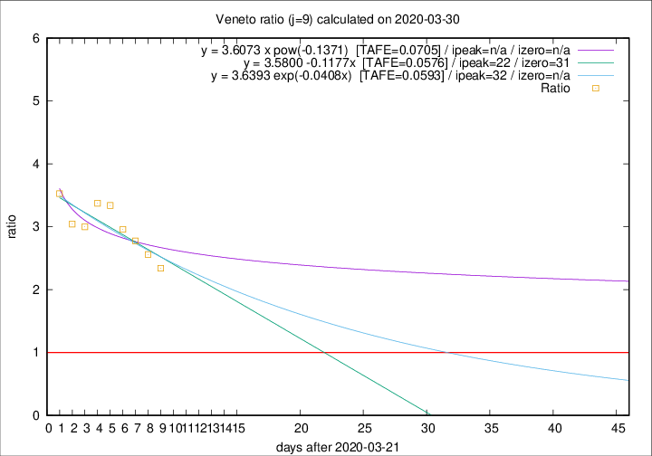

# Veneto

Data source: https://raw.githubusercontent.com/pcm-dpc/COVID-19/master/dati-json/dpc-covid19-ita-regioni.json

Estimates in this page were made on 9/4/2020 with data available until 30/03/2020.

## Summary 

### Peak estimate 
|j|linear [TAFE]|exponential [TAFE]|power law [TAFE]|details|
|---|----|-----------|---------|-------|
|7|10/4/2020 [TAFE=0.0671]|15/4/2020 [TAFE=0.0665]|-|[analysis](COVID-19_veneto_j7_2020-03-30.md)|
|8|13/4/2020 [TAFE=0.0628]|21/4/2020 [TAFE=0.0635]|-|[analysis](COVID-19_veneto_j8_2020-03-30.md)|
|9|13/4/2020 [TAFE=0.0576]|23/4/2020 [TAFE=0.0593]|-|[analysis](COVID-19_veneto_j9_2020-03-30.md)|
|10|12/4/2020 [TAFE=0.0626]|23/4/2020 [TAFE=0.0659]|-|[analysis](COVID-19_veneto_j10_2020-03-30.md)|
|11|10/4/2020 [TAFE=0.0712]|23/4/2020 [TAFE=0.0699]|-|[analysis](COVID-19_veneto_j11_2020-03-30.md)|
|12|8/4/2020 [TAFE=0.0750]|22/4/2020 [TAFE=0.0657]|-|[analysis](COVID-19_veneto_j12_2020-03-30.md)|
|13|-|-|-||
|14|-|-|-||

Best estimator is linear with j=9 (TAFE=0.0576)
Corresponding peak date estimate is 13/4/2020 (ipeak 22)

Peak date range estimate: 22/3/2020 - 25/4/2020

### End estimate 
|j|linear [TAFE/TFE]|exponential [TAFE/TFE]|power law [TAFE/TFE]|details|
|---|----|-----------|---------|-------|
|7|20/4/2020 [TAFE=0.0671]|-|-|[analysis](COVID-19_veneto_j7_2020-03-30.md)|
|8|23/4/2020 [TAFE=0.0628]|-|-|[analysis](COVID-19_veneto_j8_2020-03-30.md)|
|9|22/4/2020 [TAFE=0.0576]|-|-|[analysis](COVID-19_veneto_j9_2020-03-30.md)|
|10|-|-|-|[analysis](COVID-19_veneto_j10_2020-03-30.md)|
|11|-|-|-|[analysis](COVID-19_veneto_j11_2020-03-30.md)|
|12|-|-|-|[analysis](COVID-19_veneto_j12_2020-03-30.md)|
|13|-|-|-||
|14|-|-|-||

Best estimator is linear with j=9 (TAFE=0.0576)
Corresponding end date estimate is 22/4/2020 (izero 31)

End date range estimate: 22/3/2020 - 22/4/2020

Generated April 9th, 2020 at 16:40:48 UTC+0200 with https://github.com/robianc/COVID-19
