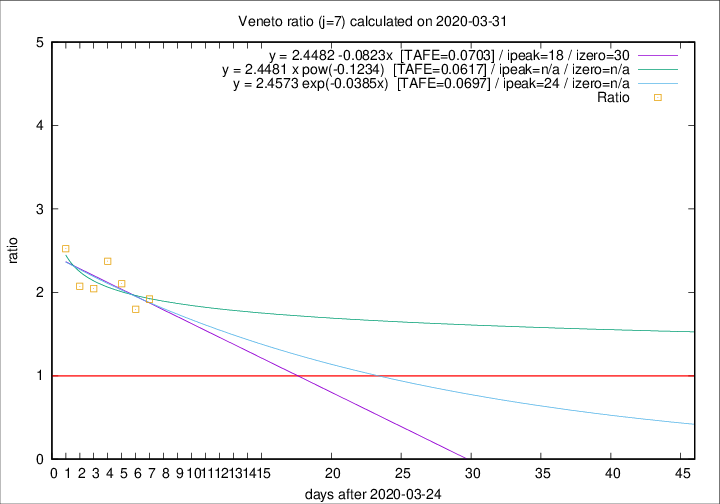

# Veneto

Data source: https://raw.githubusercontent.com/pcm-dpc/COVID-19/master/dati-json/dpc-covid19-ita-regioni.json

Delta days analysis (j): 7

Analyses for other values of j for 2020-03-31 are avalable [here](../2020-03-31/README.md)

Analyses for Veneto for previous dates are avalable [here](../README.md)

## Fitting 
|fit type|best fit equation|tafe|tfe|ipeak|izero|
|-------|-----|--------|------|---|---|
|linear|y = 2.4482 -0.0823x  [TAFE=0.0703]|0.0703|0.0057|18|30|
|exp|y = 2.4573 exp(-0.0385x)  [TAFE=0.0697]|0.0697|0.0029|24|n/a|
|pow|y = 2.4481 x pow(-0.1234)  [TAFE=0.0617]|0.0617|0.0027|n/a|n/a|

## Data
|Date|Daily deaths|Cumulated deaths|Deaths in the last 7 days|Deaths in the 7 days before|ratio|
|----|----------|-----------|-------|--------------------|-----|
|2020-03-31|64|477|261|136|1.9191|
|2020-03-30|21|413|221|123|1.7967|
|2020-03-29|30|392|223|106|2.1038|
|2020-03-28|49|362|216|91|2.3736|
|2020-03-27|26|313|182|89|2.0449|
|2020-03-26|29|287|172|83|2.0723|
|2020-03-25|42|258|164|65|2.5231|

[Download data as CSV](COVID-19_veneto_j7_2020-03-31.csv)

Generated April 14th, 2020 at 19:16:04 UTC+0200 with https://github.com/robianc/COVID-19
