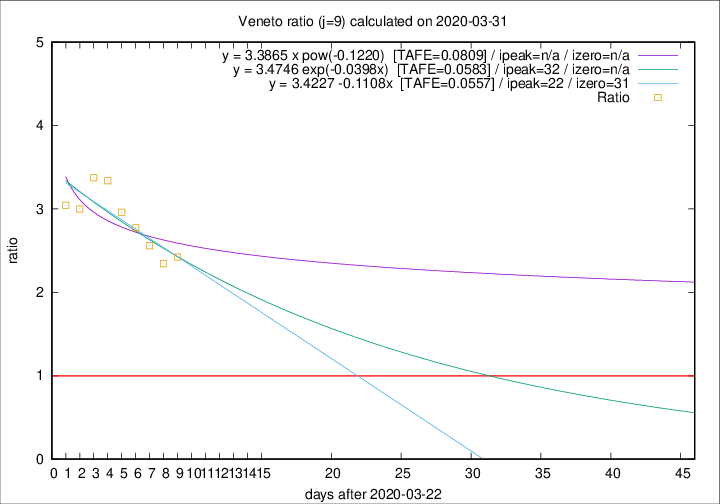

# Veneto

Data source: https://raw.githubusercontent.com/pcm-dpc/COVID-19/master/dati-json/dpc-covid19-ita-regioni.json

Delta days analysis (j): 9

Analyses for other values of j for 2020-03-31 are avalable [here](../README.md)

Analyses for Veneto for previous dates are avalable [here](../../README.md)

## Fitting 
|fit type|best fit equation|tafe|tfe|ipeak|izero|
|-------|-----|--------|------|---|---|
|linear|y = 3.4227 -0.1108x  [TAFE=0.0557]|0.0557|0.0048|22|31|
|exp|y = 3.4746 exp(-0.0398x)  [TAFE=0.0583]|0.0583|0.0026|32|n/a|
|pow|y = 3.3865 x pow(-0.1220)  [TAFE=0.0809]|0.0809|0.0043|n/a|n/a|

## Data
|Date|Daily deaths|Cumulated deaths|Deaths in the last 9 days|Deaths in the 9 days before|ratio|
|----|----------|-----------|-------|--------------------|-----|
|2020-03-31|64|477|308|127|2.4252|
|2020-03-30|21|413|267|114|2.3421|
|2020-03-29|30|392|261|102|2.5588|
|2020-03-28|49|362|247|89|2.7753|
|2020-03-27|26|313|219|74|2.9595|
|2020-03-26|29|287|207|62|3.3387|
|2020-03-25|42|258|189|56|3.3750|
|2020-03-24|24|216|153|51|3.0000|
|2020-03-23|23|192|137|45|3.0444|

[Download data as CSV](COVID-19_veneto_j9_2020-03-31.csv)

Generated April 10th, 2020 at 17:26:10 UTC+0200 with https://github.com/robianc/COVID-19
