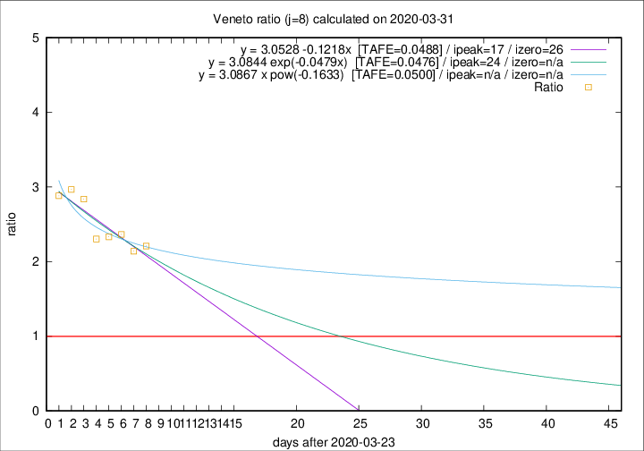

# Veneto

Data source: https://raw.githubusercontent.com/pcm-dpc/COVID-19/master/dati-json/dpc-covid19-ita-regioni.json

Estimates in this page were made on 12/4/2020 with data available until 31/03/2020.

## Summary 

### Peak estimate 
|j|linear [TAFE]|exponential [TAFE]|power law [TAFE]|details|
|---|----|-----------|---------|-------|
|7|12/4/2020 [TAFE=0.0703]|18/4/2020 [TAFE=0.0697]|-|[analysis](COVID-19_veneto_j7_2020-03-31.md)|
|8|10/4/2020 [TAFE=0.0488]|17/4/2020 [TAFE=0.0476]|-|[analysis](COVID-19_veneto_j8_2020-03-31.md)|
|9|14/4/2020 [TAFE=0.0557]|24/4/2020 [TAFE=0.0583]|-|[analysis](COVID-19_veneto_j9_2020-03-31.md)|
|10|12/4/2020 [TAFE=0.0661]|24/4/2020 [TAFE=0.0659]|-|[analysis](COVID-19_veneto_j10_2020-03-31.md)|
|11|12/4/2020 [TAFE=0.0616]|24/4/2020 [TAFE=0.0639]|-|[analysis](COVID-19_veneto_j11_2020-03-31.md)|
|12|10/4/2020 [TAFE=0.0566]|23/4/2020 [TAFE=0.0599]|-|[analysis](COVID-19_veneto_j12_2020-03-31.md)|
|13|-|-|-||
|14|-|-|-||

Best estimator is exp with j=8 (TAFE=0.0476)
Corresponding peak date estimate is 17/4/2020 (ipeak 24)

Peak date range estimate: 24/3/2020 - 27/4/2020

### End estimate 
|j|linear [TAFE/TFE]|exponential [TAFE/TFE]|power law [TAFE/TFE]|details|
|---|----|-----------|---------|-------|
|7|24/4/2020 [TAFE=0.0703]|-|-|[analysis](COVID-19_veneto_j7_2020-03-31.md)|
|8|19/4/2020 [TAFE=0.0488]|-|-|[analysis](COVID-19_veneto_j8_2020-03-31.md)|
|9|-|-|-|[analysis](COVID-19_veneto_j9_2020-03-31.md)|
|10|-|-|-|[analysis](COVID-19_veneto_j10_2020-03-31.md)|
|11|-|-|-|[analysis](COVID-19_veneto_j11_2020-03-31.md)|
|12|-|-|-|[analysis](COVID-19_veneto_j12_2020-03-31.md)|
|13|-|-|-||
|14|-|-|-||

Best estimator is linear with j=8 (TAFE=0.0488)
Corresponding end date estimate is 19/4/2020 (izero 26)

End date range estimate: 24/3/2020 - 24/4/2020

Generated April 12th, 2020 at 16:28:18 UTC+0200 with https://github.com/robianc/COVID-19
