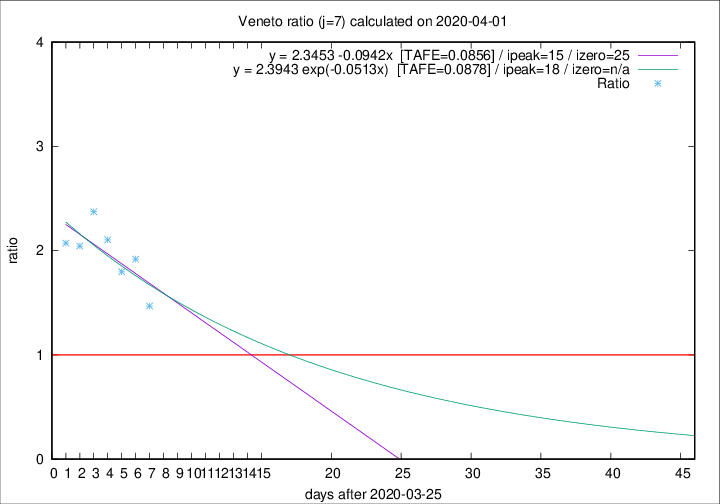

# Veneto

Data source: https://raw.githubusercontent.com/pcm-dpc/COVID-19/master/dati-json/dpc-covid19-ita-regioni.json

Delta days analysis (j): 7

Analyses for other values of j for 2020-04-01 are avalable [here](../2020-04-01/README.md)

Analyses for Veneto for previous dates are avalable [here](../README.md)

## Fitting 
|fit type|best fit equation|tafe|tfe|ipeak|izero|
|-------|-----|--------|------|---|---|
|linear|y = 2.3453 -0.0942x  [TAFE=0.0856]|0.0856|0.0091|15|25|
|exp|y = 2.3943 exp(-0.0513x)  [TAFE=0.0878]|0.0878|0.0046|18|n/a|

## Data
|Date|Daily deaths|Cumulated deaths|Deaths in the last 7 days|Deaths in the 7 days before|ratio|
|----|----------|-----------|-------|--------------------|-----|
|2020-04-01|22|499|241|164|1.4695|
|2020-03-31|64|477|261|136|1.9191|
|2020-03-30|21|413|221|123|1.7967|
|2020-03-29|30|392|223|106|2.1038|
|2020-03-28|49|362|216|91|2.3736|
|2020-03-27|26|313|182|89|2.0449|
|2020-03-26|29|287|172|83|2.0723|

[Download data as CSV](COVID-19_veneto_j7_2020-04-01.csv)

Generated April 16th, 2020 at 20:09:19 UTC+0200 with https://github.com/robianc/COVID-19
