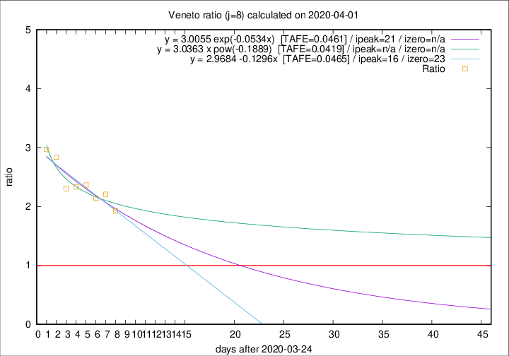

# Veneto

Data source: https://raw.githubusercontent.com/pcm-dpc/COVID-19/master/dati-json/dpc-covid19-ita-regioni.json

Delta days analysis (j): 8

Analyses for other values of j for 2020-04-01 are avalable [here](../2020-04-01/README.md)

Analyses for Veneto for previous dates are avalable [here](../README.md)

## Fitting 
|fit type|best fit equation|tafe|tfe|ipeak|izero|
|-------|-----|--------|------|---|---|
|linear|y = 2.9684 -0.1296x  [TAFE=0.0465]|0.0465|0.0028|16|23|
|exp|y = 3.0055 exp(-0.0534x)  [TAFE=0.0461]|0.0461|0.0014|21|n/a|
|pow|y = 3.0363 x pow(-0.1889)  [TAFE=0.0419]|0.0419|0.0012|n/a|n/a|

## Data
|Date|Daily deaths|Cumulated deaths|Deaths in the last 8 days|Deaths in the 8 days before|ratio|
|----|----------|-----------|-------|--------------------|-----|
|2020-04-01|22|499|283|147|1.9252|
|2020-03-31|64|477|285|129|2.2093|
|2020-03-30|21|413|244|114|2.1404|
|2020-03-29|30|392|246|104|2.3654|
|2020-03-28|49|362|231|99|2.3333|
|2020-03-27|26|313|198|86|2.3023|
|2020-03-26|29|287|193|68|2.8382|
|2020-03-25|42|258|178|60|2.9667|

[Download data as CSV](COVID-19_veneto_j8_2020-04-01.csv)

Generated April 16th, 2020 at 20:09:19 UTC+0200 with https://github.com/robianc/COVID-19
