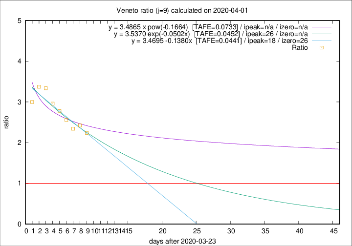

# Veneto

Data source: https://raw.githubusercontent.com/pcm-dpc/COVID-19/master/dati-json/dpc-covid19-ita-regioni.json

Estimates in this page were made on 9/4/2020 with data available until 01/04/2020.

## Summary 

### Peak estimate 
|j|linear [TAFE]|exponential [TAFE]|power law [TAFE]|details|
|---|----|-----------|---------|-------|
|7|10/4/2020 [TAFE=0.0856]|13/4/2020 [TAFE=0.0878]|-|[analysis](COVID-19_veneto_j7_2020-04-01.md)|
|8|10/4/2020 [TAFE=0.0465]|15/4/2020 [TAFE=0.0461]|-|[analysis](COVID-19_veneto_j8_2020-04-01.md)|
|9|11/4/2020 [TAFE=0.0441]|19/4/2020 [TAFE=0.0452]|-|[analysis](COVID-19_veneto_j9_2020-04-01.md)|
|10|14/4/2020 [TAFE=0.0638]|23/4/2020 [TAFE=0.0672]|-|[analysis](COVID-19_veneto_j10_2020-04-01.md)|
|11|11/4/2020 [TAFE=0.0591]|22/4/2020 [TAFE=0.0567]|-|[analysis](COVID-19_veneto_j11_2020-04-01.md)|
|12|10/4/2020 [TAFE=0.0550]|22/4/2020 [TAFE=0.0561]|-|[analysis](COVID-19_veneto_j12_2020-04-01.md)|
|13|-|-|-||
|14|-|-|-||

Best estimator is linear with j=9 (TAFE=0.0441)
Corresponding peak date estimate is 11/4/2020 (ipeak 18)

Peak date range estimate: 24/3/2020 - 25/4/2020

### End estimate 
|j|linear [TAFE/TFE]|exponential [TAFE/TFE]|power law [TAFE/TFE]|details|
|---|----|-----------|---------|-------|
|7|20/4/2020 [TAFE=0.0856]|-|-|[analysis](COVID-19_veneto_j7_2020-04-01.md)|
|8|17/4/2020 [TAFE=0.0465]|-|-|[analysis](COVID-19_veneto_j8_2020-04-01.md)|
|9|19/4/2020 [TAFE=0.0441]|-|-|[analysis](COVID-19_veneto_j9_2020-04-01.md)|
|10|-|-|-|[analysis](COVID-19_veneto_j10_2020-04-01.md)|
|11|-|-|-|[analysis](COVID-19_veneto_j11_2020-04-01.md)|
|12|-|-|-|[analysis](COVID-19_veneto_j12_2020-04-01.md)|
|13|-|-|-||
|14|-|-|-||

Best estimator is linear with j=9 (TAFE=0.0441)
Corresponding end date estimate is 19/4/2020 (izero 26)

End date range estimate: 24/3/2020 - 22/4/2020

Generated April 9th, 2020 at 16:40:48 UTC+0200 with https://github.com/robianc/COVID-19
