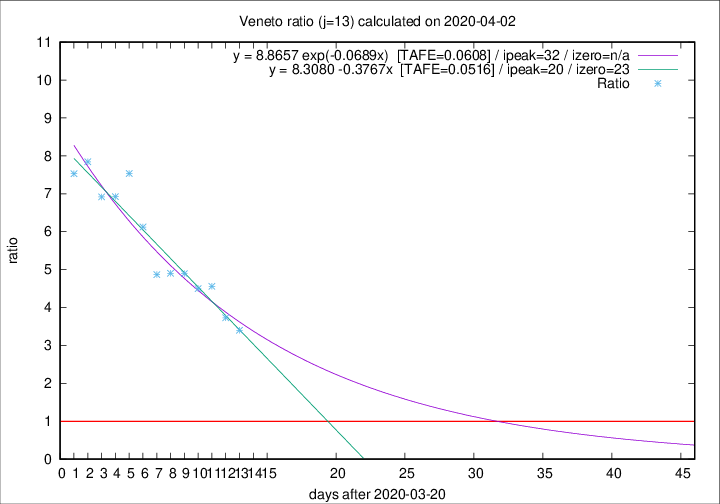

# Veneto

Data source: https://raw.githubusercontent.com/pcm-dpc/COVID-19/master/dati-json/dpc-covid19-ita-regioni.json

Delta days analysis (j): 13

Analyses for other values of j for 2020-04-02 are avalable [here](../README.md)

Analyses for Veneto for previous dates are avalable [here](../../README.md)

## Fitting 
|fit type|best fit equation|tafe|tfe|ipeak|izero|
|-------|-----|--------|------|---|---|
|linear|y = 8.3080 -0.3767x  [TAFE=0.0516]|0.0516|0.0053|20|23|
|exp|y = 8.8657 exp(-0.0689x)  [TAFE=0.0608]|0.0608|0.0028|32|n/a|

## Data
|Date|Daily deaths|Cumulated deaths|Deaths in the last 13 days|Deaths in the 13 days before|ratio|
|----|----------|-----------|-------|--------------------|-----|
|2020-04-02|33|532|401|118|3.3983|
|2020-04-01|22|499|384|103|3.7282|
|2020-03-31|64|477|383|84|4.5595|
|2020-03-30|21|413|333|74|4.5000|
|2020-03-29|30|392|323|66|4.8939|
|2020-03-28|49|362|299|61|4.9016|
|2020-03-27|26|313|258|53|4.8679|
|2020-03-26|29|287|245|40|6.1250|
|2020-03-25|42|258|226|30|7.5333|
|2020-03-24|24|216|187|27|6.9259|
|2020-03-23|23|192|166|24|6.9167|
|2020-03-22|23|169|149|19|7.8421|
|2020-03-21|15|146|128|17|7.5294|

[Download data as CSV](COVID-19_veneto_j13_2020-04-02.csv)

Generated April 10th, 2020 at 17:26:10 UTC+0200 with https://github.com/robianc/COVID-19
