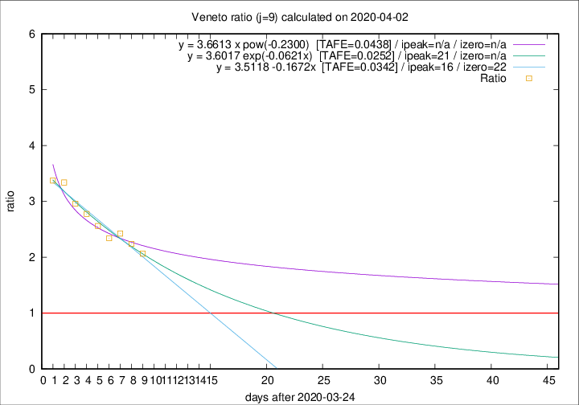

# Veneto

Data source: https://raw.githubusercontent.com/pcm-dpc/COVID-19/master/dati-json/dpc-covid19-ita-regioni.json

Estimates in this page were made on 12/4/2020 with data available until 02/04/2020.

## Summary 

### Peak estimate 
|j|linear [TAFE]|exponential [TAFE]|power law [TAFE]|details|
|---|----|-----------|---------|-------|
|7|7/4/2020 [TAFE=0.0729]|9/4/2020 [TAFE=0.0756]|2/6/2020 [TAFE=0.1065]|[analysis](COVID-19_veneto_j7_2020-04-02.md)|
|8|9/4/2020 [TAFE=0.0602]|12/4/2020 [TAFE=0.0642]|-|[analysis](COVID-19_veneto_j8_2020-04-02.md)|
|9|10/4/2020 [TAFE=0.0342]|15/4/2020 [TAFE=0.0252]|-|[analysis](COVID-19_veneto_j9_2020-04-02.md)|
|10|12/4/2020 [TAFE=0.0647]|20/4/2020 [TAFE=0.0664]|-|[analysis](COVID-19_veneto_j10_2020-04-02.md)|
|11|11/4/2020 [TAFE=0.0597]|21/4/2020 [TAFE=0.0629]|-|[analysis](COVID-19_veneto_j11_2020-04-02.md)|
|12|11/4/2020 [TAFE=0.0507]|22/4/2020 [TAFE=0.0560]|-|[analysis](COVID-19_veneto_j12_2020-04-02.md)|
|13|10/4/2020 [TAFE=0.0516]|22/4/2020 [TAFE=0.0608]|-|[analysis](COVID-19_veneto_j13_2020-04-02.md)|
|14|-|-|-||

Best estimator is exp with j=9 (TAFE=0.0252)
Corresponding peak date estimate is 15/4/2020 (ipeak 21)

Peak date range estimate: 25/3/2020 - 31/5/2020

### End estimate 
|j|linear [TAFE/TFE]|exponential [TAFE/TFE]|power law [TAFE/TFE]|details|
|---|----|-----------|---------|-------|
|7|14/4/2020 [TAFE=0.0729]|-|-|[analysis](COVID-19_veneto_j7_2020-04-02.md)|
|8|16/4/2020 [TAFE=0.0602]|-|-|[analysis](COVID-19_veneto_j8_2020-04-02.md)|
|9|16/4/2020 [TAFE=0.0342]|-|-|[analysis](COVID-19_veneto_j9_2020-04-02.md)|
|10|-|-|-|[analysis](COVID-19_veneto_j10_2020-04-02.md)|
|11|-|-|-|[analysis](COVID-19_veneto_j11_2020-04-02.md)|
|12|-|-|-|[analysis](COVID-19_veneto_j12_2020-04-02.md)|
|13|-|-|-|[analysis](COVID-19_veneto_j13_2020-04-02.md)|
|14|-|-|-||

Best estimator is linear with j=9 (TAFE=0.0342)
Corresponding end date estimate is 16/4/2020 (izero 22)

End date range estimate: 25/3/2020 - 20/4/2020

Generated April 12th, 2020 at 17:02:01 UTC+0200 with https://github.com/robianc/COVID-19
