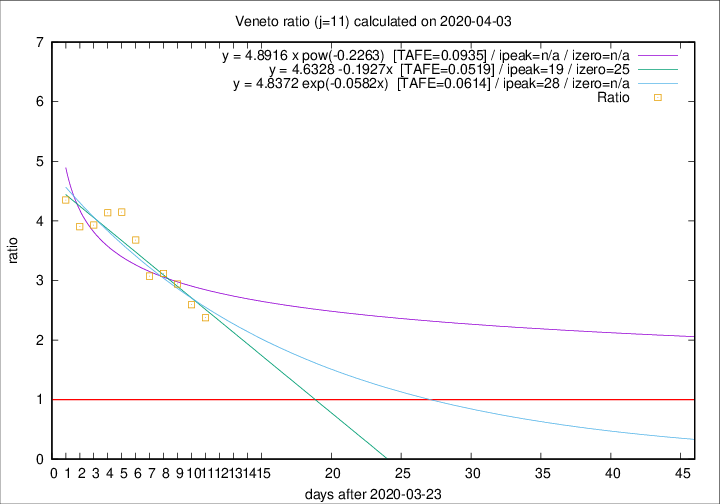

# Veneto

Data source: https://raw.githubusercontent.com/pcm-dpc/COVID-19/master/dati-json/dpc-covid19-ita-regioni.json

Delta days analysis (j): 11

Analyses for other values of j for 2020-04-03 are avalable [here](../2020-04-03/README.md)

Analyses for Veneto for previous dates are avalable [here](../README.md)

## Fitting 
|fit type|best fit equation|tafe|tfe|ipeak|izero|
|-------|-----|--------|------|---|---|
|linear|y = 4.6328 -0.1927x  [TAFE=0.0519]|0.0519|0.0047|19|25|
|exp|y = 4.8372 exp(-0.0582x)  [TAFE=0.0614]|0.0614|0.0021|28|n/a|
|pow|y = 4.8916 x pow(-0.2263)  [TAFE=0.0935]|0.0935|0.0064|n/a|n/a|

## Data
|Date|Daily deaths|Cumulated deaths|Deaths in the last 11 days|Deaths in the 11 days before|ratio|
|----|----------|-----------|-------|--------------------|-----|
|2020-04-03|40|572|380|160|2.3750|
|2020-04-02|33|532|363|140|2.5929|
|2020-04-01|22|499|353|120|2.9417|
|2020-03-31|64|477|346|111|3.1171|
|2020-03-30|21|413|298|97|3.0722|
|2020-03-29|30|392|298|81|3.6790|
|2020-03-28|49|362|282|68|4.1471|
|2020-03-27|26|313|244|59|4.1356|
|2020-03-26|29|287|224|57|3.9298|
|2020-03-25|42|258|203|52|3.9038|
|2020-03-24|24|216|174|40|4.3500|

[Download data as CSV](COVID-19_veneto_j11_2020-04-03.csv)

Generated April 16th, 2020 at 20:09:19 UTC+0200 with https://github.com/robianc/COVID-19
