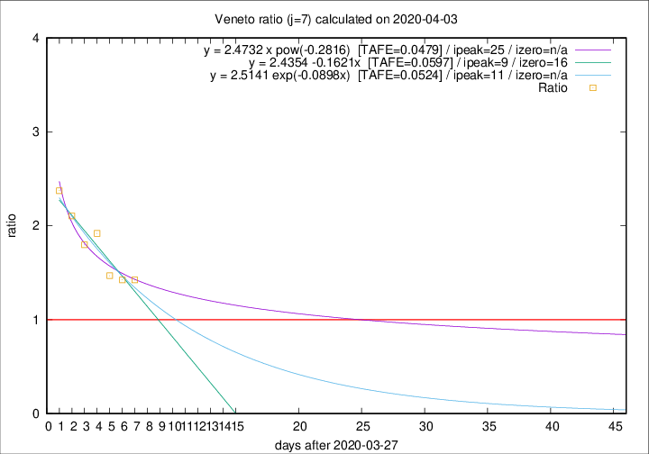

# Veneto

Data source: https://raw.githubusercontent.com/pcm-dpc/COVID-19/master/dati-json/dpc-covid19-ita-regioni.json

Delta days analysis (j): 7

## Fitting 
|fit type|best fit equation|tafe|tfe|ipeak|izero|
|-------|-----|--------|------|---|---|
|linear|y = 2.4354 -0.1621x  [TAFE=0.0597]|0.0597|0.0034|9|16|
|exp|y = 2.5141 exp(-0.0898x)  [TAFE=0.0524]|0.0524|0.0020|11|n/a|
|pow|y = 2.4732 x pow(-0.2816)  [TAFE=0.0479]|0.0479|0.0020|25|n/a|

## Data
|Date|Daily deaths|Cumulated deaths|Deaths in the last 7 days|Deaths in the 7 days before|ratio|
|----|----------|-----------|-------|--------------------|-----|
|2020-04-03|40|572|259|182|1.4231|
|2020-04-02|33|532|245|172|1.4244|
|2020-04-01|22|499|241|164|1.4695|
|2020-03-31|64|477|261|136|1.9191|
|2020-03-30|21|413|221|123|1.7967|
|2020-03-29|30|392|223|106|2.1038|
|2020-03-28|49|362|216|91|2.3736|

[Download data as CSV](COVID-19_veneto_j7_2020-04-03.csv)

Generated April 9th, 2020 at 16:40:48 UTC+0200 with https://github.com/robianc/COVID-19
