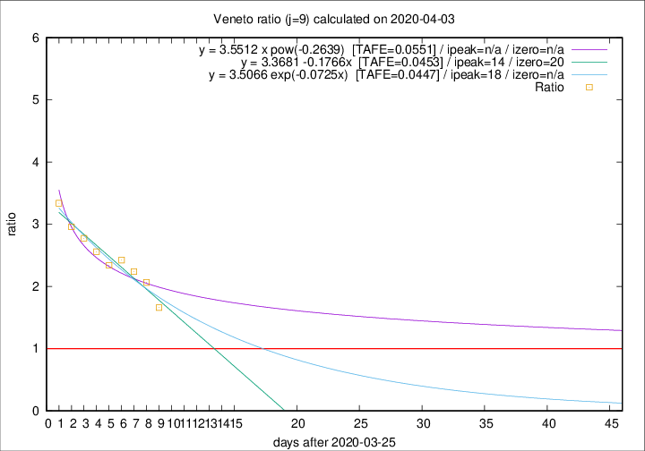

# Veneto

Data source: https://raw.githubusercontent.com/pcm-dpc/COVID-19/master/dati-json/dpc-covid19-ita-regioni.json

Delta days analysis (j): 9

Analyses for other values of j for 2020-04-03 are avalable [here](../2020-04-03/README.md)

Analyses for Veneto for previous dates are avalable [here](../README.md)

## Fitting 
|fit type|best fit equation|tafe|tfe|ipeak|izero|
|-------|-----|--------|------|---|---|
|linear|y = 3.3681 -0.1766x  [TAFE=0.0453]|0.0453|0.0021|14|20|
|exp|y = 3.5066 exp(-0.0725x)  [TAFE=0.0447]|0.0447|0.0015|18|n/a|
|pow|y = 3.5512 x pow(-0.2639)  [TAFE=0.0551]|0.0551|0.0029|n/a|n/a|

## Data
|Date|Daily deaths|Cumulated deaths|Deaths in the last 9 days|Deaths in the 9 days before|ratio|
|----|----------|-----------|-------|--------------------|-----|
|2020-04-03|40|572|314|189|1.6614|
|2020-04-02|33|532|316|153|2.0654|
|2020-04-01|22|499|307|137|2.2409|
|2020-03-31|64|477|308|127|2.4252|
|2020-03-30|21|413|267|114|2.3421|
|2020-03-29|30|392|261|102|2.5588|
|2020-03-28|49|362|247|89|2.7753|
|2020-03-27|26|313|219|74|2.9595|
|2020-03-26|29|287|207|62|3.3387|

[Download data as CSV](COVID-19_veneto_j9_2020-04-03.csv)

Generated April 12th, 2020 at 17:02:01 UTC+0200 with https://github.com/robianc/COVID-19
