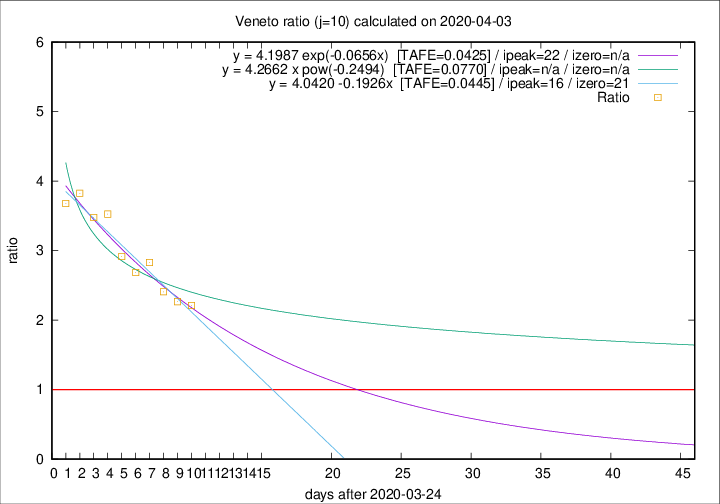

# Veneto

Data source: https://raw.githubusercontent.com/pcm-dpc/COVID-19/master/dati-json/dpc-covid19-ita-regioni.json

Estimates in this page were made on 16/4/2020 with data available until 03/04/2020.

## Summary 

### Peak estimate 
|j|linear [TAFE]|exponential [TAFE]|power law [TAFE]|details|
|---|----|-----------|---------|-------|
|7|6/4/2020 [TAFE=0.0597]|8/4/2020 [TAFE=0.0524]|22/4/2020 [TAFE=0.0479]|[analysis](COVID-19_veneto_j7_2020-04-03.md)|
|8|9/4/2020 [TAFE=0.0627]|11/4/2020 [TAFE=0.0709]|-|[analysis](COVID-19_veneto_j8_2020-04-03.md)|
|9|9/4/2020 [TAFE=0.0453]|13/4/2020 [TAFE=0.0447]|-|[analysis](COVID-19_veneto_j9_2020-04-03.md)|
|10|10/4/2020 [TAFE=0.0445]|16/4/2020 [TAFE=0.0425]|-|[analysis](COVID-19_veneto_j10_2020-04-03.md)|
|11|12/4/2020 [TAFE=0.0519]|21/4/2020 [TAFE=0.0614]|-|[analysis](COVID-19_veneto_j11_2020-04-03.md)|
|12|10/4/2020 [TAFE=0.0494]|20/4/2020 [TAFE=0.0482]|-|[analysis](COVID-19_veneto_j12_2020-04-03.md)|
|13|10/4/2020 [TAFE=0.0553]|21/4/2020 [TAFE=0.0516]|-|[analysis](COVID-19_veneto_j13_2020-04-03.md)|
|14|-|-|-||

Best estimator is exp with j=10 (TAFE=0.0425)
Corresponding peak date estimate is 16/4/2020 (ipeak 22)

Peak date range estimate: 25/3/2020 - 24/4/2020

### End estimate 
|j|linear [TAFE/TFE]|exponential [TAFE/TFE]|power law [TAFE/TFE]|details|
|---|----|-----------|---------|-------|
|7|13/4/2020 [TAFE=0.0597]|-|-|[analysis](COVID-19_veneto_j7_2020-04-03.md)|
|8|-|-|-|[analysis](COVID-19_veneto_j8_2020-04-03.md)|
|9|15/4/2020 [TAFE=0.0453]|-|-|[analysis](COVID-19_veneto_j9_2020-04-03.md)|
|10|15/4/2020 [TAFE=0.0445]|-|-|[analysis](COVID-19_veneto_j10_2020-04-03.md)|
|11|-|-|-|[analysis](COVID-19_veneto_j11_2020-04-03.md)|
|12|-|-|-|[analysis](COVID-19_veneto_j12_2020-04-03.md)|
|13|-|-|-|[analysis](COVID-19_veneto_j13_2020-04-03.md)|
|14|-|-|-||

Best estimator is linear with j=10 (TAFE=0.0445)
Corresponding end date estimate is 15/4/2020 (izero 21)

End date range estimate: 25/3/2020 - 19/4/2020

Generated April 16th, 2020 at 20:09:19 UTC+0200 with https://github.com/robianc/COVID-19
