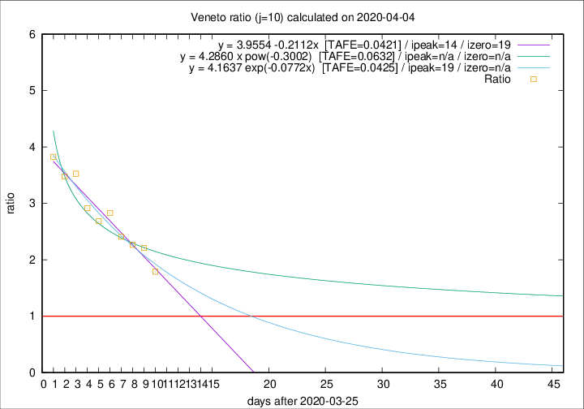

# Veneto

Data source: https://raw.githubusercontent.com/pcm-dpc/COVID-19/master/dati-json/dpc-covid19-ita-regioni.json

Delta days analysis (j): 10

Analyses for other values of j for 2020-04-04 are avalable [here](../2020-04-04/README.md)

Analyses for Veneto for previous dates are avalable [here](../README.md)

## Fitting 
|fit type|best fit equation|tafe|tfe|ipeak|izero|
|-------|-----|--------|------|---|---|
|linear|y = 3.9554 -0.2112x  [TAFE=0.0421]|0.0421|0.0021|14|19|
|exp|y = 4.1637 exp(-0.0772x)  [TAFE=0.0425]|0.0425|0.0011|19|n/a|
|pow|y = 4.2860 x pow(-0.3002)  [TAFE=0.0632]|0.0632|0.0041|n/a|n/a|

## Data
|Date|Daily deaths|Cumulated deaths|Deaths in the last 10 days|Deaths in the 10 days before|ratio|
|----|----------|-----------|-------|--------------------|-----|
|2020-04-04|35|607|349|195|1.7897|
|2020-04-03|40|572|356|161|2.2112|
|2020-04-02|33|532|340|150|2.2667|
|2020-04-01|22|499|330|137|2.4088|
|2020-03-31|64|477|331|117|2.8291|
|2020-03-30|21|413|282|105|2.6857|
|2020-03-29|30|392|277|95|2.9158|
|2020-03-28|49|362|268|76|3.5263|
|2020-03-27|26|313|233|67|3.4776|
|2020-03-26|29|287|218|57|3.8246|

[Download data as CSV](COVID-19_veneto_j10_2020-04-04.csv)

Generated April 12th, 2020 at 17:02:01 UTC+0200 with https://github.com/robianc/COVID-19
