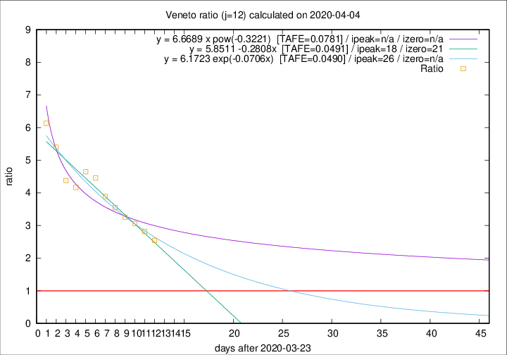

# Veneto

Data source: https://raw.githubusercontent.com/pcm-dpc/COVID-19/master/dati-json/dpc-covid19-ita-regioni.json

Delta days analysis (j): 12

Analyses for other values of j for 2020-04-04 are avalable [here](../2020-04-04/README.md)

Analyses for Veneto for previous dates are avalable [here](../README.md)

## Fitting 
|fit type|best fit equation|tafe|tfe|ipeak|izero|
|-------|-----|--------|------|---|---|
|linear|y = 5.8511 -0.2808x  [TAFE=0.0491]|0.0491|0.0034|18|21|
|exp|y = 6.1723 exp(-0.0706x)  [TAFE=0.0490]|0.0490|0.0024|26|n/a|
|pow|y = 6.6689 x pow(-0.3221)  [TAFE=0.0781]|0.0781|0.0047|n/a|n/a|

## Data
|Date|Daily deaths|Cumulated deaths|Deaths in the last 12 days|Deaths in the 12 days before|ratio|
|----|----------|-----------|-------|--------------------|-----|
|2020-04-04|35|607|415|163|2.5460|
|2020-04-03|40|572|403|143|2.8182|
|2020-04-02|33|532|386|126|3.0635|
|2020-04-01|22|499|368|113|3.2566|
|2020-03-31|64|477|362|102|3.5490|
|2020-03-30|21|413|319|82|3.8902|
|2020-03-29|30|392|312|70|4.4571|
|2020-03-28|49|362|293|63|4.6508|
|2020-03-27|26|313|250|60|4.1667|
|2020-03-26|29|287|232|53|4.3774|
|2020-03-25|42|258|216|40|5.4000|
|2020-03-24|24|216|184|30|6.1333|

[Download data as CSV](COVID-19_veneto_j12_2020-04-04.csv)

Generated April 16th, 2020 at 20:09:19 UTC+0200 with https://github.com/robianc/COVID-19
