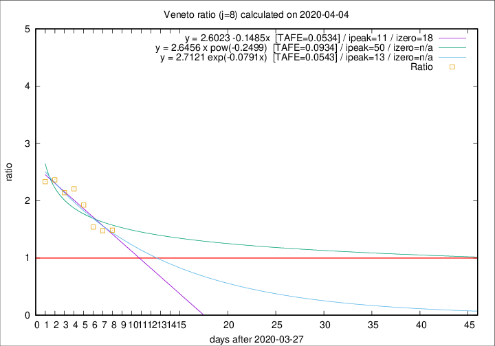

# Veneto

Data source: https://raw.githubusercontent.com/pcm-dpc/COVID-19/master/dati-json/dpc-covid19-ita-regioni.json

Delta days analysis (j): 8

## Fitting 
|fit type|best fit equation|tafe|tfe|ipeak|izero|
|-------|-----|--------|------|---|---|
|linear|y = 2.6023 -0.1485x  [TAFE=0.0534]|0.0534|0.0039|11|18|
|exp|y = 2.7121 exp(-0.0791x)  [TAFE=0.0543]|0.0543|0.0022|13|n/a|
|pow|y = 2.6456 x pow(-0.2499)  [TAFE=0.0934]|0.0934|0.0049|50|n/a|

## Data
|Date|Daily deaths|Cumulated deaths|Deaths in the last 8 days|Deaths in the 8 days before|ratio|
|----|----------|-----------|-------|--------------------|-----|
|2020-04-04|35|607|294|198|1.4848|
|2020-04-03|40|572|285|193|1.4767|
|2020-04-02|33|532|274|178|1.5393|
|2020-04-01|22|499|283|147|1.9252|
|2020-03-31|64|477|285|129|2.2093|
|2020-03-30|21|413|244|114|2.1404|
|2020-03-29|30|392|246|104|2.3654|
|2020-03-28|49|362|231|99|2.3333|

[Download data as CSV](COVID-19_veneto_j8_2020-04-04.csv)

Generated April 9th, 2020 at 16:40:48 UTC+0200 with https://github.com/robianc/COVID-19
