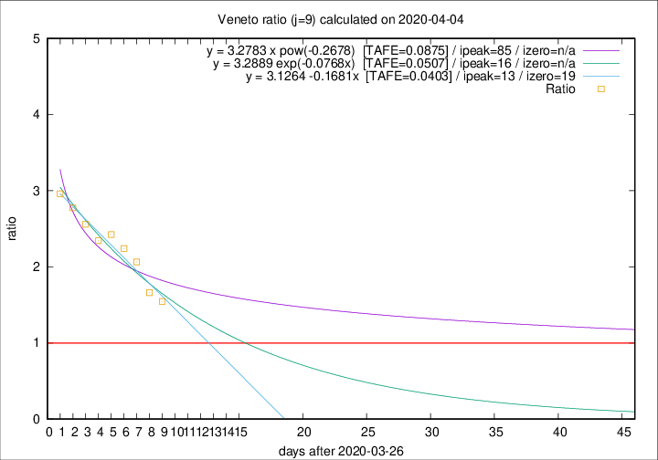

# Veneto

Data source: https://raw.githubusercontent.com/pcm-dpc/COVID-19/master/dati-json/dpc-covid19-ita-regioni.json

Estimates in this page were made on 12/4/2020 with data available until 04/04/2020.

## Summary 

### Peak estimate 
|j|linear [TAFE]|exponential [TAFE]|power law [TAFE]|details|
|---|----|-----------|---------|-------|
|7|7/4/2020 [TAFE=0.0564]|7/4/2020 [TAFE=0.0540]|16/4/2020 [TAFE=0.0641]|[analysis](COVID-19_veneto_j7_2020-04-04.md)|
|8|8/4/2020 [TAFE=0.0534]|10/4/2020 [TAFE=0.0543]|17/5/2020 [TAFE=0.0934]|[analysis](COVID-19_veneto_j8_2020-04-04.md)|
|9|9/4/2020 [TAFE=0.0403]|12/4/2020 [TAFE=0.0507]|20/6/2020 [TAFE=0.0875]|[analysis](COVID-19_veneto_j9_2020-04-04.md)|
|10|9/4/2020 [TAFE=0.0421]|14/4/2020 [TAFE=0.0425]|-|[analysis](COVID-19_veneto_j10_2020-04-04.md)|
|11|12/4/2020 [TAFE=0.0506]|19/4/2020 [TAFE=0.0603]|-|[analysis](COVID-19_veneto_j11_2020-04-04.md)|
|12|11/4/2020 [TAFE=0.0491]|19/4/2020 [TAFE=0.0490]|-|[analysis](COVID-19_veneto_j12_2020-04-04.md)|
|13|10/4/2020 [TAFE=0.0586]|20/4/2020 [TAFE=0.0533]|-|[analysis](COVID-19_veneto_j13_2020-04-04.md)|
|14|-|-|-||

Best estimator is linear with j=9 (TAFE=0.0403)
Corresponding peak date estimate is 9/4/2020 (ipeak 13)

Peak date range estimate: 27/3/2020 - 20/6/2020

### End estimate 
|j|linear [TAFE/TFE]|exponential [TAFE/TFE]|power law [TAFE/TFE]|details|
|---|----|-----------|---------|-------|
|7|13/4/2020 [TAFE=0.0564]|-|-|[analysis](COVID-19_veneto_j7_2020-04-04.md)|
|8|15/4/2020 [TAFE=0.0534]|-|-|[analysis](COVID-19_veneto_j8_2020-04-04.md)|
|9|15/4/2020 [TAFE=0.0403]|-|-|[analysis](COVID-19_veneto_j9_2020-04-04.md)|
|10|-|-|-|[analysis](COVID-19_veneto_j10_2020-04-04.md)|
|11|-|-|-|[analysis](COVID-19_veneto_j11_2020-04-04.md)|
|12|-|-|-|[analysis](COVID-19_veneto_j12_2020-04-04.md)|
|13|-|-|-|[analysis](COVID-19_veneto_j13_2020-04-04.md)|
|14|-|-|-||

Best estimator is linear with j=9 (TAFE=0.0403)
Corresponding end date estimate is 15/4/2020 (izero 19)

End date range estimate: 27/3/2020 - 19/4/2020

Generated April 12th, 2020 at 16:28:18 UTC+0200 with https://github.com/robianc/COVID-19
