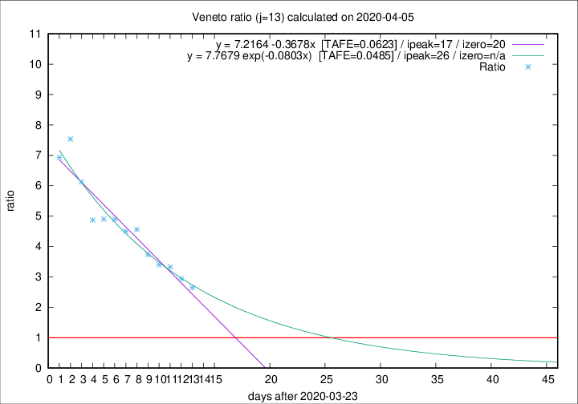

# Veneto

Data source: https://raw.githubusercontent.com/pcm-dpc/COVID-19/master/dati-json/dpc-covid19-ita-regioni.json

Delta days analysis (j): 13

## Fitting 
|fit type|best fit equation|tafe|tfe|ipeak|izero|
|-------|-----|--------|------|---|---|
|linear|y = 7.2164 -0.3678x  [TAFE=0.0623]|0.0623|0.0025|17|20|
|exp|y = 7.7679 exp(-0.0803x)  [TAFE=0.0485]|0.0485|0.0024|26|n/a|

## Data
|Date|Daily deaths|Cumulated deaths|Deaths in the last 13 days|Deaths in the 13 days before|ratio|
|----|----------|-----------|-------|--------------------|-----|
|2020-04-05|24|631|439|166|2.6446|
|2020-04-04|35|607|438|149|2.9396|
|2020-04-03|40|572|426|128|3.3281|
|2020-04-02|33|532|401|118|3.3983|
|2020-04-01|22|499|384|103|3.7282|
|2020-03-31|64|477|383|84|4.5595|
|2020-03-30|21|413|333|74|4.5000|
|2020-03-29|30|392|323|66|4.8939|
|2020-03-28|49|362|299|61|4.9016|
|2020-03-27|26|313|258|53|4.8679|
|2020-03-26|29|287|245|40|6.1250|
|2020-03-25|42|258|226|30|7.5333|
|2020-03-24|24|216|187|27|6.9259|

[Download data as CSV](COVID-19_veneto_j13_2020-04-05.csv)

Generated April 8th, 2020 at 23:43:36 UTC+0200 with https://github.com/robianc/COVID-19
