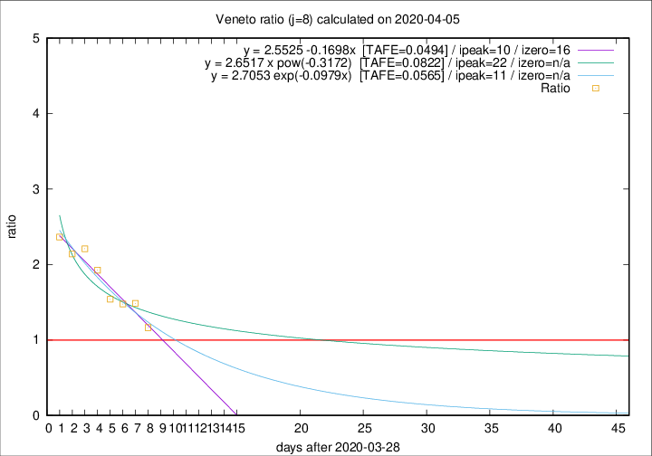

# Veneto

Data source: https://raw.githubusercontent.com/pcm-dpc/COVID-19/master/dati-json/dpc-covid19-ita-regioni.json

Delta days analysis (j): 8

## Fitting 
|fit type|best fit equation|tafe|tfe|ipeak|izero|
|-------|-----|--------|------|---|---|
|linear|y = 2.5525 -0.1698x  [TAFE=0.0494]|0.0494|0.0035|10|16|
|exp|y = 2.7053 exp(-0.0979x)  [TAFE=0.0565]|0.0565|0.0018|11|n/a|
|pow|y = 2.6517 x pow(-0.3172)  [TAFE=0.0822]|0.0822|0.0052|22|n/a|

## Data
|Date|Daily deaths|Cumulated deaths|Deaths in the last 8 days|Deaths in the 8 days before|ratio|
|----|----------|-----------|-------|--------------------|-----|
|2020-04-05|24|631|269|231|1.1645|
|2020-04-04|35|607|294|198|1.4848|
|2020-04-03|40|572|285|193|1.4767|
|2020-04-02|33|532|274|178|1.5393|
|2020-04-01|22|499|283|147|1.9252|
|2020-03-31|64|477|285|129|2.2093|
|2020-03-30|21|413|244|114|2.1404|
|2020-03-29|30|392|246|104|2.3654|

[Download data as CSV](COVID-19_veneto_j8_2020-04-05.csv)

Generated April 8th, 2020 at 23:43:36 UTC+0200 with https://github.com/robianc/COVID-19
