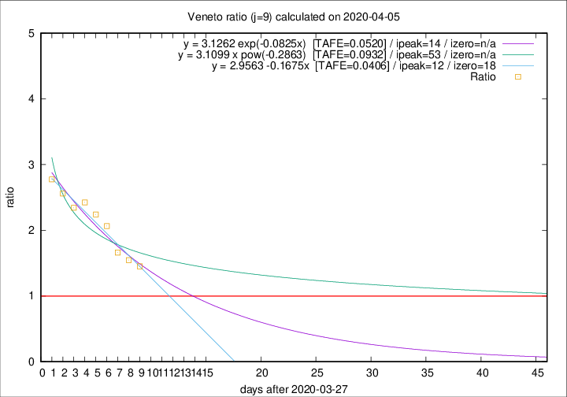

# Veneto

Data source: https://raw.githubusercontent.com/pcm-dpc/COVID-19/master/dati-json/dpc-covid19-ita-regioni.json

Estimates in this page were made on 9/4/2020 with data available until 05/04/2020.

## Summary 

### Peak estimate 
|j|linear [TAFE]|exponential [TAFE]|power law [TAFE]|details|
|---|----|-----------|---------|-------|
|7|7/4/2020 [TAFE=0.0548]|7/4/2020 [TAFE=0.0535]|12/4/2020 [TAFE=0.0815]|[analysis](COVID-19_veneto_j7_2020-04-05.md)|
|8|8/4/2020 [TAFE=0.0494]|9/4/2020 [TAFE=0.0565]|20/4/2020 [TAFE=0.0822]|[analysis](COVID-19_veneto_j8_2020-04-05.md)|
|9|9/4/2020 [TAFE=0.0406]|11/4/2020 [TAFE=0.0520]|20/5/2020 [TAFE=0.0932]|[analysis](COVID-19_veneto_j9_2020-04-05.md)|
|10|10/4/2020 [TAFE=0.0423]|13/4/2020 [TAFE=0.0531]|13/6/2020 [TAFE=0.0951]|[analysis](COVID-19_veneto_j10_2020-04-05.md)|
|11|11/4/2020 [TAFE=0.0414]|15/4/2020 [TAFE=0.0508]|-|[analysis](COVID-19_veneto_j11_2020-04-05.md)|
|12|12/4/2020 [TAFE=0.0411]|19/4/2020 [TAFE=0.0532]|-|[analysis](COVID-19_veneto_j12_2020-04-05.md)|
|13|10/4/2020 [TAFE=0.0623]|19/4/2020 [TAFE=0.0485]|-|[analysis](COVID-19_veneto_j13_2020-04-05.md)|
|14|10/4/2020 [TAFE=0.0642]|20/4/2020 [TAFE=0.0501]|-|[analysis](COVID-19_veneto_j14_2020-04-05.md)|

Best estimator is linear with j=9 (TAFE=0.0406)
Corresponding peak date estimate is 9/4/2020 (ipeak 12)

Peak date range estimate: 28/3/2020 - 14/6/2020

### End estimate 
|j|linear [TAFE/TFE]|exponential [TAFE/TFE]|power law [TAFE/TFE]|details|
|---|----|-----------|---------|-------|
|7|14/4/2020 [TAFE=0.0548]|-|-|[analysis](COVID-19_veneto_j7_2020-04-05.md)|
|8|14/4/2020 [TAFE=0.0494]|-|-|[analysis](COVID-19_veneto_j8_2020-04-05.md)|
|9|15/4/2020 [TAFE=0.0406]|-|-|[analysis](COVID-19_veneto_j9_2020-04-05.md)|
|10|-|-|-|[analysis](COVID-19_veneto_j10_2020-04-05.md)|
|11|-|-|-|[analysis](COVID-19_veneto_j11_2020-04-05.md)|
|12|-|-|-|[analysis](COVID-19_veneto_j12_2020-04-05.md)|
|13|-|-|-|[analysis](COVID-19_veneto_j13_2020-04-05.md)|
|14|-|-|-|[analysis](COVID-19_veneto_j14_2020-04-05.md)|

Best estimator is linear with j=9 (TAFE=0.0406)
Corresponding end date estimate is 15/4/2020 (izero 18)

End date range estimate: 28/3/2020 - 19/4/2020

Generated April 9th, 2020 at 16:40:48 UTC+0200 with https://github.com/robianc/COVID-19
