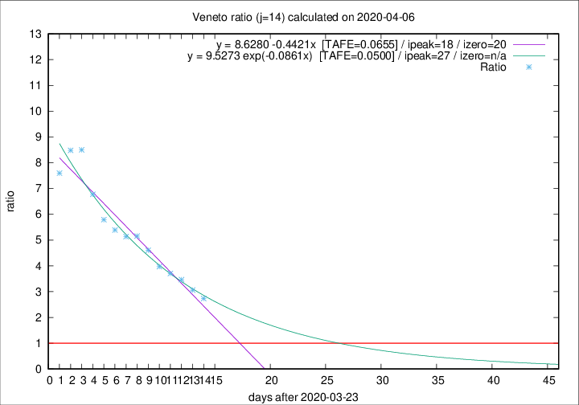

# Veneto

Data source: https://raw.githubusercontent.com/pcm-dpc/COVID-19/master/dati-json/dpc-covid19-ita-regioni.json

Delta days analysis (j): 14

Analyses for other values of j for 2020-04-06 are avalable [here](../README.md)

Analyses for Veneto for previous dates are avalable [here](../../README.md)

## Fitting 
|fit type|best fit equation|tafe|tfe|ipeak|izero|
|-------|-----|--------|------|---|---|
|linear|y = 8.6280 -0.4421x  [TAFE=0.0655]|0.0655|0.0015|18|20|
|exp|y = 9.5273 exp(-0.0861x)  [TAFE=0.0500]|0.0500|0.0021|27|n/a|

## Data
|Date|Daily deaths|Cumulated deaths|Deaths in the last 14 days|Deaths in the 14 days before|ratio|
|----|----------|-----------|-------|--------------------|-----|
|2020-04-06|31|662|470|172|2.7326|
|2020-04-05|24|631|462|151|3.0596|
|2020-04-04|35|607|461|133|3.4662|
|2020-04-03|40|572|441|119|3.7059|
|2020-04-02|33|532|417|105|3.9714|
|2020-04-01|22|499|405|88|4.6023|
|2020-03-31|64|477|397|77|5.1558|
|2020-03-30|21|413|344|67|5.1343|
|2020-03-29|30|392|329|61|5.3934|
|2020-03-28|49|362|307|53|5.7925|
|2020-03-27|26|313|271|40|6.7750|
|2020-03-26|29|287|255|30|8.5000|
|2020-03-25|42|258|229|27|8.4815|
|2020-03-24|24|216|190|25|7.6000|

[Download data as CSV](COVID-19_veneto_j14_2020-04-06.csv)

Generated April 12th, 2020 at 16:28:18 UTC+0200 with https://github.com/robianc/COVID-19
