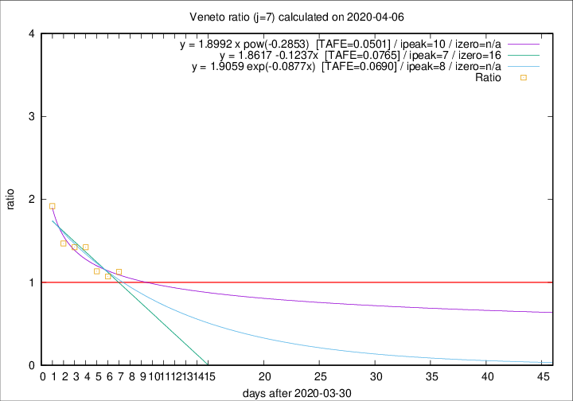

# Veneto

Data source: https://raw.githubusercontent.com/pcm-dpc/COVID-19/master/dati-json/dpc-covid19-ita-regioni.json

Delta days analysis (j): 7

Analyses for other values of j for 2020-04-06 are avalable [here](../2020-04-06/README.md)

Analyses for Veneto for previous dates are avalable [here](../README.md)

## Fitting 
|fit type|best fit equation|tafe|tfe|ipeak|izero|
|-------|-----|--------|------|---|---|
|linear|y = 1.8617 -0.1237x  [TAFE=0.0765]|0.0765|0.0051|7|16|
|exp|y = 1.9059 exp(-0.0877x)  [TAFE=0.0690]|0.0690|0.0028|8|n/a|
|pow|y = 1.8992 x pow(-0.2853)  [TAFE=0.0501]|0.0501|0.0017|10|n/a|

## Data
|Date|Daily deaths|Cumulated deaths|Deaths in the last 7 days|Deaths in the 7 days before|ratio|
|----|----------|-----------|-------|--------------------|-----|
|2020-04-06|31|662|249|221|1.1267|
|2020-04-05|24|631|239|223|1.0717|
|2020-04-04|35|607|245|216|1.1343|
|2020-04-03|40|572|259|182|1.4231|
|2020-04-02|33|532|245|172|1.4244|
|2020-04-01|22|499|241|164|1.4695|
|2020-03-31|64|477|261|136|1.9191|

[Download data as CSV](COVID-19_veneto_j7_2020-04-06.csv)

Generated April 19th, 2020 at 18:42:39 UTC+0200 with https://github.com/robianc/COVID-19
