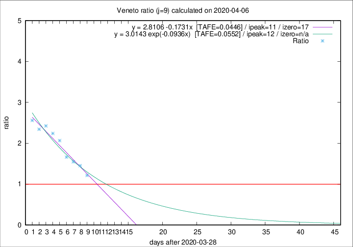

# Veneto

Data source: https://raw.githubusercontent.com/pcm-dpc/COVID-19/master/dati-json/dpc-covid19-ita-regioni.json

Delta days analysis (j): 9

## Fitting 
|fit type|best fit equation|tafe|tfe|ipeak|izero|
|-------|-----|--------|------|---|---|
|linear|y = 2.8106 -0.1731x  [TAFE=0.0446]|0.0446|0.0032|11|17|
|exp|y = 3.0143 exp(-0.0936x)  [TAFE=0.0552]|0.0552|0.0017|12|n/a|

## Data
|Date|Daily deaths|Cumulated deaths|Deaths in the last 9 days|Deaths in the 9 days before|ratio|
|----|----------|-----------|-------|--------------------|-----|
|2020-04-06|31|662|300|247|1.2146|
|2020-04-05|24|631|318|219|1.4521|
|2020-04-04|35|607|320|207|1.5459|
|2020-04-03|40|572|314|189|1.6614|
|2020-04-02|33|532|316|153|2.0654|
|2020-04-01|22|499|307|137|2.2409|
|2020-03-31|64|477|308|127|2.4252|
|2020-03-30|21|413|267|114|2.3421|
|2020-03-29|30|392|261|102|2.5588|

[Download data as CSV](COVID-19_veneto_j9_2020-04-06.csv)

Generated April 8th, 2020 at 23:43:36 UTC+0200 with https://github.com/robianc/COVID-19
