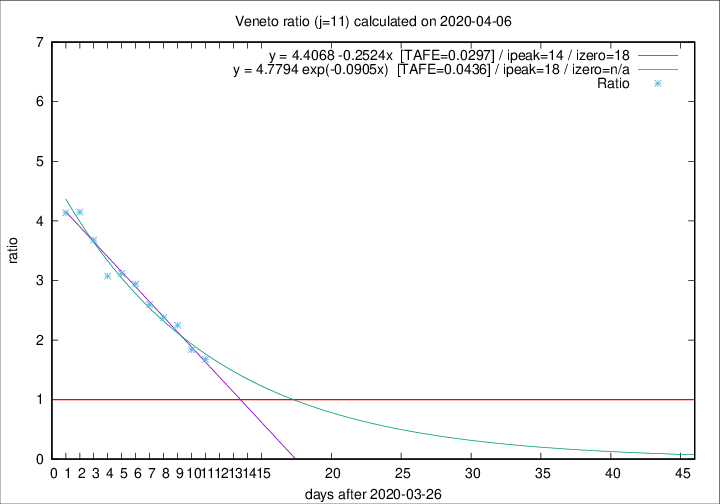

# Veneto

Data source: https://raw.githubusercontent.com/pcm-dpc/COVID-19/master/dati-json/dpc-covid19-ita-regioni.json

Estimates in this page were made on 12/4/2020 with data available until 06/04/2020.

## Summary 

### Peak estimate 
|j|linear [TAFE]|exponential [TAFE]|power law [TAFE]|details|
|---|----|-----------|---------|-------|
|7|7/4/2020 [TAFE=0.0765]|8/4/2020 [TAFE=0.0690]|10/4/2020 [TAFE=0.0501]|[analysis](COVID-19_veneto_j7_2020-04-06.md)|
|8|8/4/2020 [TAFE=0.0561]|8/4/2020 [TAFE=0.0519]|14/4/2020 [TAFE=0.0906]|[analysis](COVID-19_veneto_j8_2020-04-06.md)|
|9|9/4/2020 [TAFE=0.0446]|10/4/2020 [TAFE=0.0552]|29/4/2020 [TAFE=0.1015]|[analysis](COVID-19_veneto_j9_2020-04-06.md)|
|10|10/4/2020 [TAFE=0.0467]|12/4/2020 [TAFE=0.0480]|16/5/2020 [TAFE=0.0942]|[analysis](COVID-19_veneto_j10_2020-04-06.md)|
|11|10/4/2020 [TAFE=0.0297]|14/4/2020 [TAFE=0.0436]|11/6/2020 [TAFE=0.1022]|[analysis](COVID-19_veneto_j11_2020-04-06.md)|
|12|12/4/2020 [TAFE=0.0440]|17/4/2020 [TAFE=0.0701]|-|[analysis](COVID-19_veneto_j12_2020-04-06.md)|
|13|11/4/2020 [TAFE=0.0644]|18/4/2020 [TAFE=0.0476]|-|[analysis](COVID-19_veneto_j13_2020-04-06.md)|
|14|11/4/2020 [TAFE=0.0655]|20/4/2020 [TAFE=0.0500]|-|[analysis](COVID-19_veneto_j14_2020-04-06.md)|

Best estimator is linear with j=11 (TAFE=0.0297)
Corresponding peak date estimate is 10/4/2020 (ipeak 14)

Peak date range estimate: 27/3/2020 - 11/6/2020

### End estimate 
|j|linear [TAFE/TFE]|exponential [TAFE/TFE]|power law [TAFE/TFE]|details|
|---|----|-----------|---------|-------|
|7|16/4/2020 [TAFE=0.0765]|-|-|[analysis](COVID-19_veneto_j7_2020-04-06.md)|
|8|14/4/2020 [TAFE=0.0561]|-|-|[analysis](COVID-19_veneto_j8_2020-04-06.md)|
|9|15/4/2020 [TAFE=0.0446]|-|-|[analysis](COVID-19_veneto_j9_2020-04-06.md)|
|10|-|-|-|[analysis](COVID-19_veneto_j10_2020-04-06.md)|
|11|14/4/2020 [TAFE=0.0297]|-|-|[analysis](COVID-19_veneto_j11_2020-04-06.md)|
|12|-|-|-|[analysis](COVID-19_veneto_j12_2020-04-06.md)|
|13|-|-|-|[analysis](COVID-19_veneto_j13_2020-04-06.md)|
|14|-|-|-|[analysis](COVID-19_veneto_j14_2020-04-06.md)|

Best estimator is linear with j=11 (TAFE=0.0297)
Corresponding end date estimate is 14/4/2020 (izero 18)

End date range estimate: 27/3/2020 - 17/4/2020

Generated April 12th, 2020 at 17:02:01 UTC+0200 with https://github.com/robianc/COVID-19
