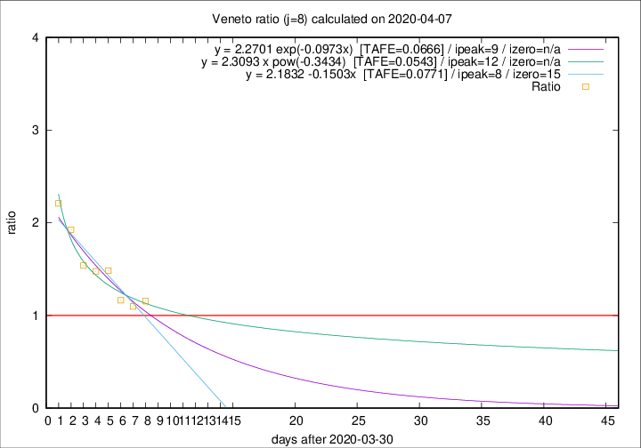

# Veneto

Data source: https://raw.githubusercontent.com/pcm-dpc/COVID-19/master/dati-json/dpc-covid19-ita-regioni.json

Delta days analysis (j): 8

Analyses for other values of j for 2020-04-07 are avalable [here](../README.md)

Analyses for Veneto for previous dates are avalable [here](../../README.md)

## Fitting 
|fit type|best fit equation|tafe|tfe|ipeak|izero|
|-------|-----|--------|------|---|---|
|linear|y = 2.1832 -0.1503x  [TAFE=0.0771]|0.0771|0.0048|8|15|
|exp|y = 2.2701 exp(-0.0973x)  [TAFE=0.0666]|0.0666|0.0027|9|n/a|
|pow|y = 2.3093 x pow(-0.3434)  [TAFE=0.0543]|0.0543|0.0018|12|n/a|

## Data
|Date|Daily deaths|Cumulated deaths|Deaths in the last 8 days|Deaths in the 8 days before|ratio|
|----|----------|-----------|-------|--------------------|-----|
|2020-04-07|33|695|282|244|1.1557|
|2020-04-06|31|662|270|246|1.0976|
|2020-04-05|24|631|269|231|1.1645|
|2020-04-04|35|607|294|198|1.4848|
|2020-04-03|40|572|285|193|1.4767|
|2020-04-02|33|532|274|178|1.5393|
|2020-04-01|22|499|283|147|1.9252|
|2020-03-31|64|477|285|129|2.2093|

[Download data as CSV](COVID-19_veneto_j8_2020-04-07.csv)

Generated April 10th, 2020 at 17:26:10 UTC+0200 with https://github.com/robianc/COVID-19
