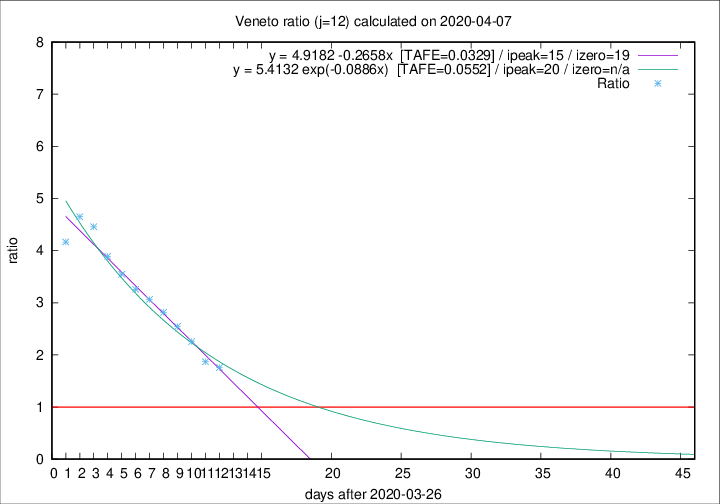

# Veneto

Data source: https://raw.githubusercontent.com/pcm-dpc/COVID-19/master/dati-json/dpc-covid19-ita-regioni.json

Estimates in this page were made on 10/4/2020 with data available until 07/04/2020.

## Summary 

### Peak estimate 
|j|linear [TAFE]|exponential [TAFE]|power law [TAFE]|details|
|---|----|-----------|---------|-------|
|7|8/4/2020 [TAFE=0.0586]|8/4/2020 [TAFE=0.0604]|8/4/2020 [TAFE=0.0815]|[analysis](COVID-19_veneto_j7_2020-04-07.md)|
|8|8/4/2020 [TAFE=0.0771]|9/4/2020 [TAFE=0.0666]|12/4/2020 [TAFE=0.0543]|[analysis](COVID-19_veneto_j8_2020-04-07.md)|
|9|9/4/2020 [TAFE=0.0483]|10/4/2020 [TAFE=0.0451]|19/4/2020 [TAFE=0.1000]|[analysis](COVID-19_veneto_j9_2020-04-07.md)|
|10|10/4/2020 [TAFE=0.0386]|12/4/2020 [TAFE=0.0526]|4/5/2020 [TAFE=0.1185]|[analysis](COVID-19_veneto_j10_2020-04-07.md)|
|11|10/4/2020 [TAFE=0.0375]|13/4/2020 [TAFE=0.0354]|19/5/2020 [TAFE=0.0976]|[analysis](COVID-19_veneto_j11_2020-04-07.md)|
|12|11/4/2020 [TAFE=0.0329]|16/4/2020 [TAFE=0.0552]|-|[analysis](COVID-19_veneto_j12_2020-04-07.md)|
|13|12/4/2020 [TAFE=0.0392]|18/4/2020 [TAFE=0.0522]|-|[analysis](COVID-19_veneto_j13_2020-04-07.md)|
|14|11/4/2020 [TAFE=0.0752]|19/4/2020 [TAFE=0.0386]|-|[analysis](COVID-19_veneto_j14_2020-04-07.md)|

Best estimator is linear with j=12 (TAFE=0.0329)
Corresponding peak date estimate is 11/4/2020 (ipeak 15)

Peak date range estimate: 27/3/2020 - 18/5/2020

### End estimate 
|j|linear [TAFE/TFE]|exponential [TAFE/TFE]|power law [TAFE/TFE]|details|
|---|----|-----------|---------|-------|
|7|17/4/2020 [TAFE=0.0586]|-|-|[analysis](COVID-19_veneto_j7_2020-04-07.md)|
|8|-|-|-|[analysis](COVID-19_veneto_j8_2020-04-07.md)|
|9|15/4/2020 [TAFE=0.0483]|-|-|[analysis](COVID-19_veneto_j9_2020-04-07.md)|
|10|15/4/2020 [TAFE=0.0386]|-|-|[analysis](COVID-19_veneto_j10_2020-04-07.md)|
|11|14/4/2020 [TAFE=0.0375]|-|-|[analysis](COVID-19_veneto_j11_2020-04-07.md)|
|12|15/4/2020 [TAFE=0.0329]|-|-|[analysis](COVID-19_veneto_j12_2020-04-07.md)|
|13|-|-|-|[analysis](COVID-19_veneto_j13_2020-04-07.md)|
|14|-|-|-|[analysis](COVID-19_veneto_j14_2020-04-07.md)|

Best estimator is linear with j=12 (TAFE=0.0329)
Corresponding end date estimate is 15/4/2020 (izero 19)

End date range estimate: 27/3/2020 - 16/4/2020

Generated April 10th, 2020 at 17:26:10 UTC+0200 with https://github.com/robianc/COVID-19
