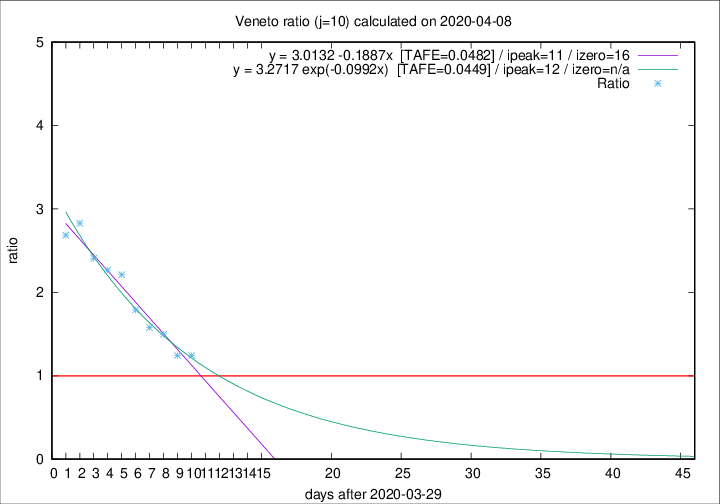

# Veneto

Data source: https://raw.githubusercontent.com/pcm-dpc/COVID-19/master/dati-json/dpc-covid19-ita-regioni.json

Delta days analysis (j): 10

## Fitting 
|fit type|best fit equation|tafe|tfe|ipeak|izero|
|-------|-----|--------|------|---|---|
|linear|y = 3.0132 -0.1887x  [TAFE=0.0482]|0.0482|0.0024|11|16|
|exp|y = 3.2717 exp(-0.0992x)  [TAFE=0.0449]|0.0449|0.0018|12|n/a|

## Data
|Date|Daily deaths|Cumulated deaths|Deaths in the last 10 days|Deaths in the 10 days before|ratio|
|----|----------|-----------|-------|--------------------|-----|
|2020-04-08|41|736|344|277|1.2419|
|2020-04-07|33|695|333|268|1.2425|
|2020-04-06|31|662|349|233|1.4979|
|2020-04-05|24|631|344|218|1.5780|
|2020-04-04|35|607|349|195|1.7897|
|2020-04-03|40|572|356|161|2.2112|
|2020-04-02|33|532|340|150|2.2667|
|2020-04-01|22|499|330|137|2.4088|
|2020-03-31|64|477|331|117|2.8291|
|2020-03-30|21|413|282|105|2.6857|

[Download data as CSV](COVID-19_veneto_j10_2020-04-08.csv)

Generated April 8th, 2020 at 23:43:36 UTC+0200 with https://github.com/robianc/COVID-19
