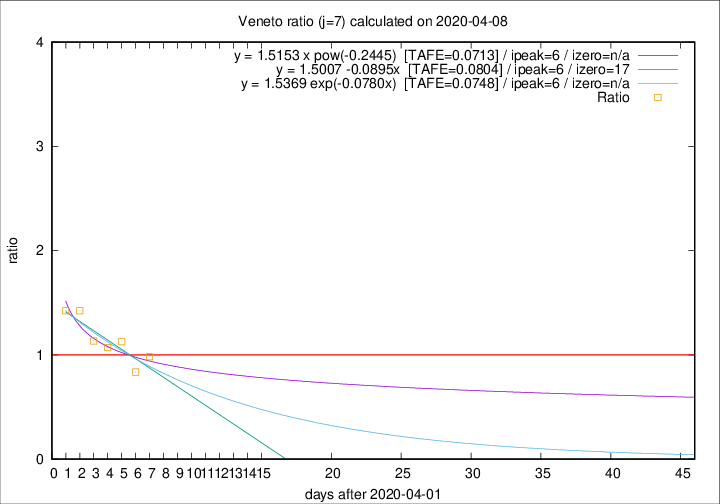

# Veneto

Data source: https://raw.githubusercontent.com/pcm-dpc/COVID-19/master/dati-json/dpc-covid19-ita-regioni.json

Delta days analysis (j): 7

Analyses for other values of j for 2020-04-08 are avalable [here](../2020-04-08/README.md)

Analyses for Veneto for previous dates are avalable [here](../README.md)

## Fitting 
|fit type|best fit equation|tafe|tfe|ipeak|izero|
|-------|-----|--------|------|---|---|
|linear|y = 1.5007 -0.0895x  [TAFE=0.0804]|0.0804|0.0071|6|17|
|exp|y = 1.5369 exp(-0.0780x)  [TAFE=0.0748]|0.0748|0.0036|6|n/a|
|pow|y = 1.5153 x pow(-0.2445)  [TAFE=0.0713]|0.0713|0.0038|6|n/a|

## Data
|Date|Daily deaths|Cumulated deaths|Deaths in the last 7 days|Deaths in the 7 days before|ratio|
|----|----------|-----------|-------|--------------------|-----|
|2020-04-08|41|736|237|241|0.9834|
|2020-04-07|33|695|218|261|0.8352|
|2020-04-06|31|662|249|221|1.1267|
|2020-04-05|24|631|239|223|1.0717|
|2020-04-04|35|607|245|216|1.1343|
|2020-04-03|40|572|259|182|1.4231|
|2020-04-02|33|532|245|172|1.4244|

[Download data as CSV](COVID-19_veneto_j7_2020-04-08.csv)

Generated April 12th, 2020 at 17:02:01 UTC+0200 with https://github.com/robianc/COVID-19
