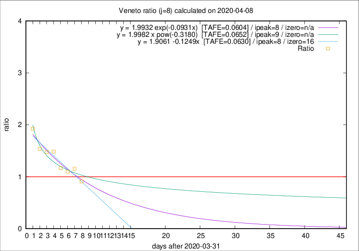

# Veneto

Data source: https://raw.githubusercontent.com/pcm-dpc/COVID-19/master/dati-json/dpc-covid19-ita-regioni.json

Delta days analysis (j): 8

## Fitting 
|fit type|best fit equation|tafe|tfe|ipeak|izero|
|-------|-----|--------|------|---|---|
|linear|y = 1.9061 -0.1249x  [TAFE=0.0630]|0.0630|0.0038|8|16|
|exp|y = 1.9932 exp(-0.0931x)  [TAFE=0.0604]|0.0604|0.0022|8|n/a|
|pow|y = 1.9982 x pow(-0.3180)  [TAFE=0.0652]|0.0652|0.0030|9|n/a|

## Data
|Date|Daily deaths|Cumulated deaths|Deaths in the last 8 days|Deaths in the 8 days before|ratio|
|----|----------|-----------|-------|--------------------|-----|
|2020-04-08|41|736|259|285|0.9088|
|2020-04-07|33|695|282|244|1.1557|
|2020-04-06|31|662|270|246|1.0976|
|2020-04-05|24|631|269|231|1.1645|
|2020-04-04|35|607|294|198|1.4848|
|2020-04-03|40|572|285|193|1.4767|
|2020-04-02|33|532|274|178|1.5393|
|2020-04-01|22|499|283|147|1.9252|

[Download data as CSV](COVID-19_veneto_j8_2020-04-08.csv)

Generated April 9th, 2020 at 16:40:48 UTC+0200 with https://github.com/robianc/COVID-19
