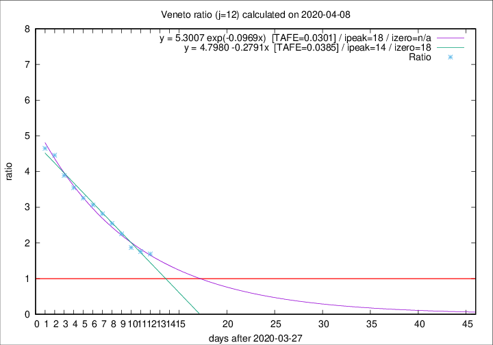

# Veneto

Data source: https://raw.githubusercontent.com/pcm-dpc/COVID-19/master/dati-json/dpc-covid19-ita-regioni.json

Estimates in this page were made on 12/4/2020 with data available until 08/04/2020.

## Summary 

### Peak estimate 
|j|linear [TAFE]|exponential [TAFE]|power law [TAFE]|details|
|---|----|-----------|---------|-------|
|7|8/4/2020 [TAFE=0.0804]|8/4/2020 [TAFE=0.0748]|8/4/2020 [TAFE=0.0713]|[analysis](COVID-19_veneto_j7_2020-04-08.md)|
|8|9/4/2020 [TAFE=0.0630]|9/4/2020 [TAFE=0.0604]|10/4/2020 [TAFE=0.0652]|[analysis](COVID-19_veneto_j8_2020-04-08.md)|
|9|9/4/2020 [TAFE=0.0654]|10/4/2020 [TAFE=0.0477]|15/4/2020 [TAFE=0.0632]|[analysis](COVID-19_veneto_j9_2020-04-08.md)|
|10|10/4/2020 [TAFE=0.0482]|11/4/2020 [TAFE=0.0449]|24/4/2020 [TAFE=0.1115]|[analysis](COVID-19_veneto_j10_2020-04-08.md)|
|11|11/4/2020 [TAFE=0.0350]|13/4/2020 [TAFE=0.0398]|7/5/2020 [TAFE=0.1186]|[analysis](COVID-19_veneto_j11_2020-04-08.md)|
|12|11/4/2020 [TAFE=0.0385]|15/4/2020 [TAFE=0.0301]|26/5/2020 [TAFE=0.1146]|[analysis](COVID-19_veneto_j12_2020-04-08.md)|
|13|12/4/2020 [TAFE=0.0356]|17/4/2020 [TAFE=0.0617]|-|[analysis](COVID-19_veneto_j13_2020-04-08.md)|
|14|11/4/2020 [TAFE=0.0621]|18/4/2020 [TAFE=0.0460]|-|[analysis](COVID-19_veneto_j14_2020-04-08.md)|

Best estimator is exp with j=12 (TAFE=0.0301)
Corresponding peak date estimate is 15/4/2020 (ipeak 18)

Peak date range estimate: 28/3/2020 - 26/5/2020

### End estimate 
|j|linear [TAFE/TFE]|exponential [TAFE/TFE]|power law [TAFE/TFE]|details|
|---|----|-----------|---------|-------|
|7|19/4/2020 [TAFE=0.0804]|-|-|[analysis](COVID-19_veneto_j7_2020-04-08.md)|
|8|17/4/2020 [TAFE=0.0630]|-|-|[analysis](COVID-19_veneto_j8_2020-04-08.md)|
|9|-|-|-|[analysis](COVID-19_veneto_j9_2020-04-08.md)|
|10|15/4/2020 [TAFE=0.0482]|-|-|[analysis](COVID-19_veneto_j10_2020-04-08.md)|
|11|15/4/2020 [TAFE=0.0350]|-|-|[analysis](COVID-19_veneto_j11_2020-04-08.md)|
|12|-|-|-|[analysis](COVID-19_veneto_j12_2020-04-08.md)|
|13|-|-|-|[analysis](COVID-19_veneto_j13_2020-04-08.md)|
|14|-|-|-|[analysis](COVID-19_veneto_j14_2020-04-08.md)|

Best estimator is linear with j=11 (TAFE=0.0350)
Corresponding end date estimate is 15/4/2020 (izero 17)

End date range estimate: 29/3/2020 - 18/4/2020

Generated April 12th, 2020 at 16:28:18 UTC+0200 with https://github.com/robianc/COVID-19
