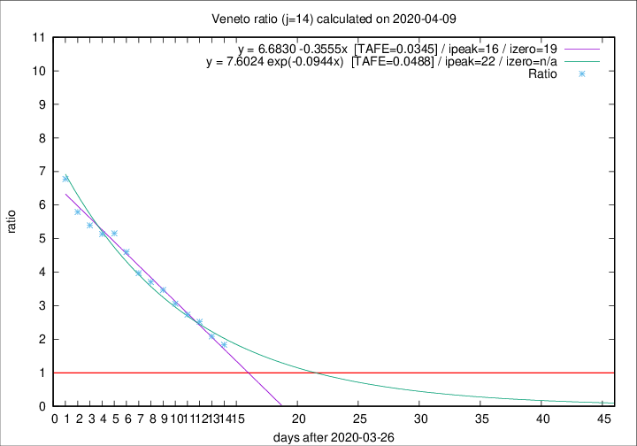

# Veneto

Data source: https://raw.githubusercontent.com/pcm-dpc/COVID-19/master/dati-json/dpc-covid19-ita-regioni.json

Estimates in this page were made on 14/4/2020 with data available until 09/04/2020.

## Summary 

### Peak estimate 
|j|linear [TAFE]|exponential [TAFE]|power law [TAFE]|details|
|---|----|-----------|---------|-------|
|7|8/4/2020 [TAFE=0.0871]|8/4/2020 [TAFE=0.0814]|8/4/2020 [TAFE=0.0592]|[analysis](COVID-19_veneto_j7_2020-04-09.md)|
|8|9/4/2020 [TAFE=0.0549]|9/4/2020 [TAFE=0.0519]|10/4/2020 [TAFE=0.0729]|[analysis](COVID-19_veneto_j8_2020-04-09.md)|
|9|10/4/2020 [TAFE=0.0660]|10/4/2020 [TAFE=0.0493]|12/4/2020 [TAFE=0.0708]|[analysis](COVID-19_veneto_j9_2020-04-09.md)|
|10|11/4/2020 [TAFE=0.0675]|12/4/2020 [TAFE=0.0425]|19/4/2020 [TAFE=0.0726]|[analysis](COVID-19_veneto_j10_2020-04-09.md)|
|11|11/4/2020 [TAFE=0.0347]|13/4/2020 [TAFE=0.0390]|29/4/2020 [TAFE=0.1229]|[analysis](COVID-19_veneto_j11_2020-04-09.md)|
|12|11/4/2020 [TAFE=0.0394]|14/4/2020 [TAFE=0.0364]|9/5/2020 [TAFE=0.1196]|[analysis](COVID-19_veneto_j12_2020-04-09.md)|
|13|12/4/2020 [TAFE=0.0401]|16/4/2020 [TAFE=0.0439]|11/6/2020 [TAFE=0.1428]|[analysis](COVID-19_veneto_j13_2020-04-09.md)|
|14|12/4/2020 [TAFE=0.0345]|18/4/2020 [TAFE=0.0488]|-|[analysis](COVID-19_veneto_j14_2020-04-09.md)|

Best estimator is linear with j=14 (TAFE=0.0345)
Corresponding peak date estimate is 12/4/2020 (ipeak 16)

Peak date range estimate: 27/3/2020 - 10/6/2020

### End estimate 
|j|linear [TAFE/TFE]|exponential [TAFE/TFE]|power law [TAFE/TFE]|details|
|---|----|-----------|---------|-------|
|7|22/4/2020 [TAFE=0.0871]|-|-|[analysis](COVID-19_veneto_j7_2020-04-09.md)|
|8|19/4/2020 [TAFE=0.0549]|-|-|[analysis](COVID-19_veneto_j8_2020-04-09.md)|
|9|-|-|-|[analysis](COVID-19_veneto_j9_2020-04-09.md)|
|10|-|-|-|[analysis](COVID-19_veneto_j10_2020-04-09.md)|
|11|16/4/2020 [TAFE=0.0347]|-|-|[analysis](COVID-19_veneto_j11_2020-04-09.md)|
|12|-|-|-|[analysis](COVID-19_veneto_j12_2020-04-09.md)|
|13|-|-|-|[analysis](COVID-19_veneto_j13_2020-04-09.md)|
|14|15/4/2020 [TAFE=0.0345]|-|-|[analysis](COVID-19_veneto_j14_2020-04-09.md)|

Best estimator is linear with j=14 (TAFE=0.0345)
Corresponding end date estimate is 15/4/2020 (izero 19)

End date range estimate: 27/3/2020 - 15/4/2020

Generated April 14th, 2020 at 19:16:04 UTC+0200 with https://github.com/robianc/COVID-19
