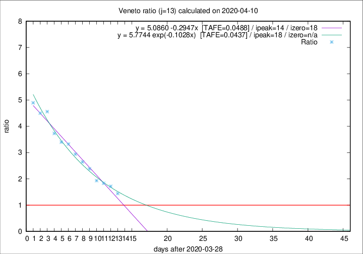

# Veneto

Data source: https://raw.githubusercontent.com/pcm-dpc/COVID-19/master/dati-json/dpc-covid19-ita-regioni.json

Delta days analysis (j): 13

Analyses for other values of j for 2020-04-10 are avalable [here](../2020-04-10/README.md)

Analyses for Veneto for previous dates are avalable [here](../README.md)

## Fitting 
|fit type|best fit equation|tafe|tfe|ipeak|izero|
|-------|-----|--------|------|---|---|
|linear|y = 5.0860 -0.2947x  [TAFE=0.0488]|0.0488|-0.0020|14|18|
|exp|y = 5.7744 exp(-0.1028x)  [TAFE=0.0437]|0.0437|0.0009|18|n/a|

## Data
|Date|Daily deaths|Cumulated deaths|Deaths in the last 13 days|Deaths in the 13 days before|ratio|
|----|----------|-----------|-------|--------------------|-----|
|2020-04-10|37|793|431|299|1.4415|
|2020-04-09|20|756|443|258|1.7171|
|2020-04-08|41|736|449|245|1.8327|
|2020-04-07|33|695|437|226|1.9336|
|2020-04-06|31|662|446|187|2.3850|
|2020-04-05|24|631|439|166|2.6446|
|2020-04-04|35|607|438|149|2.9396|
|2020-04-03|40|572|426|128|3.3281|
|2020-04-02|33|532|401|118|3.3983|
|2020-04-01|22|499|384|103|3.7282|
|2020-03-31|64|477|383|84|4.5595|
|2020-03-30|21|413|333|74|4.5000|
|2020-03-29|30|392|323|66|4.8939|

[Download data as CSV](COVID-19_veneto_j13_2020-04-10.csv)

Generated April 16th, 2020 at 20:09:19 UTC+0200 with https://github.com/robianc/COVID-19
