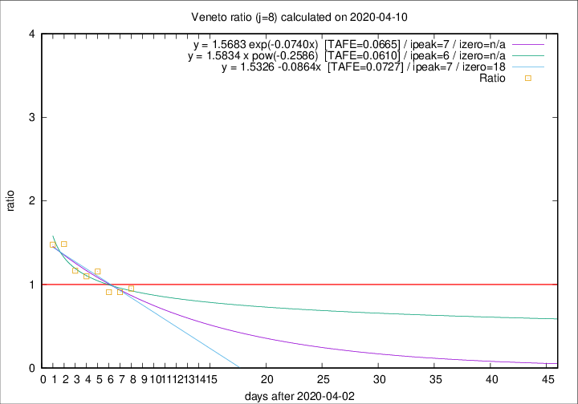

# Veneto

Data source: https://raw.githubusercontent.com/pcm-dpc/COVID-19/master/dati-json/dpc-covid19-ita-regioni.json

Delta days analysis (j): 8

Analyses for other values of j for 2020-04-10 are avalable [here](../2020-04-10/README.md)

Analyses for Veneto for previous dates are avalable [here](../README.md)

## Fitting 
|fit type|best fit equation|tafe|tfe|ipeak|izero|
|-------|-----|--------|------|---|---|
|linear|y = 1.5326 -0.0864x  [TAFE=0.0727]|0.0727|0.0054|7|18|
|exp|y = 1.5683 exp(-0.0740x)  [TAFE=0.0665]|0.0665|0.0028|7|n/a|
|pow|y = 1.5834 x pow(-0.2586)  [TAFE=0.0610]|0.0610|0.0025|6|n/a|

## Data
|Date|Daily deaths|Cumulated deaths|Deaths in the last 8 days|Deaths in the 8 days before|ratio|
|----|----------|-----------|-------|--------------------|-----|
|2020-04-10|37|793|261|274|0.9526|
|2020-04-09|20|756|257|283|0.9081|
|2020-04-08|41|736|259|285|0.9088|
|2020-04-07|33|695|282|244|1.1557|
|2020-04-06|31|662|270|246|1.0976|
|2020-04-05|24|631|269|231|1.1645|
|2020-04-04|35|607|294|198|1.4848|
|2020-04-03|40|572|285|193|1.4767|

[Download data as CSV](COVID-19_veneto_j8_2020-04-10.csv)

Generated April 16th, 2020 at 20:09:19 UTC+0200 with https://github.com/robianc/COVID-19
